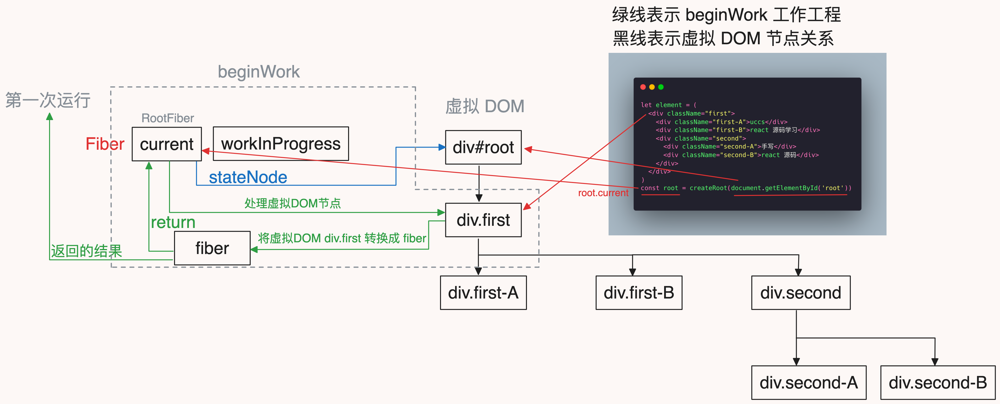
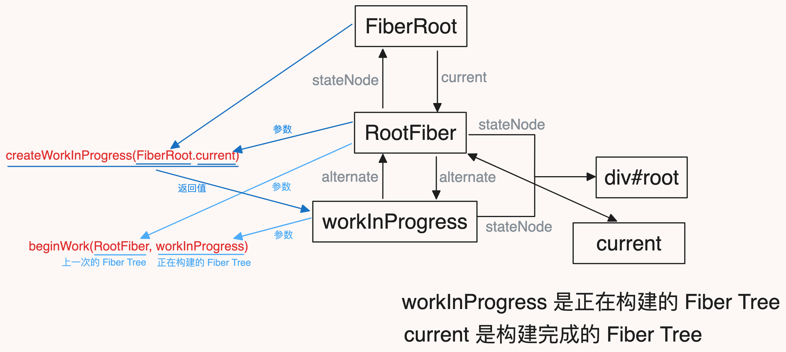
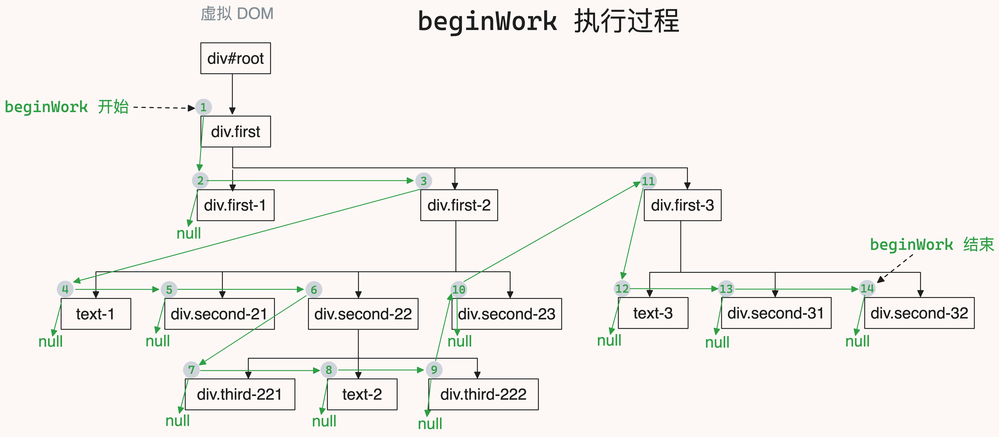
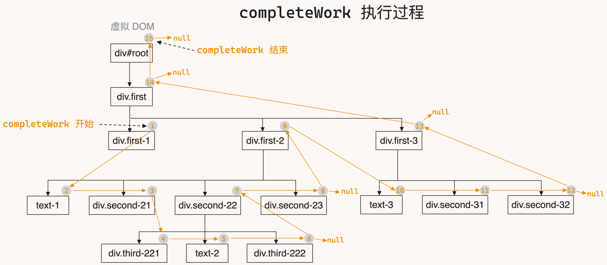
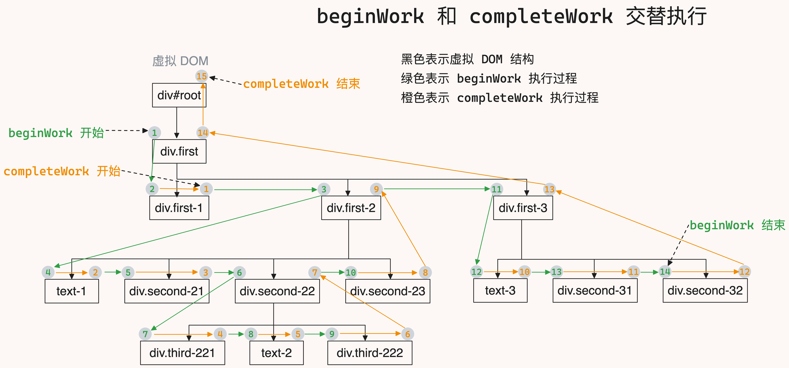
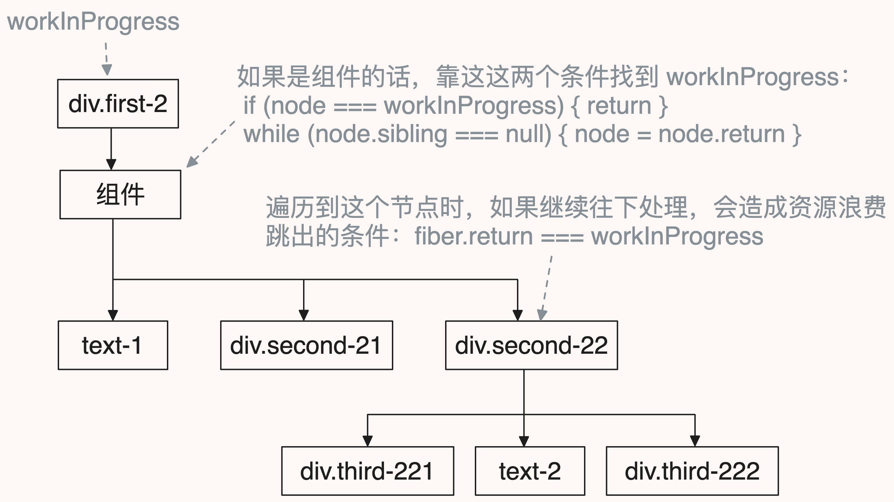
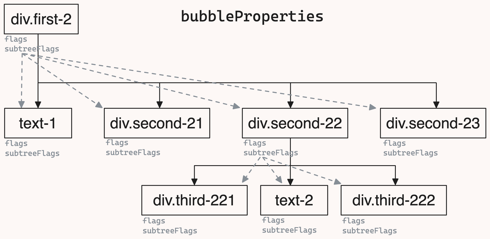

上一篇我们把 `beginWork` 功能介绍完了，但是不意味着 `beginWork` 结束了，实际上 `beginWork` 和 `completeWork` 是交替进行的

`beginWork` 工作结束后，会返回一个 `fiber` 节点，这个节点会传给 `completeWork`

工作过程：




## completeWork 和 beginWork 工作过程

在调用 `completeWork` 之前，先要梳理一下 `react` 是怎么遍历 `fiber` 树的

`beginWork` 和 `completeWork` 不是单独执行，而是交替执行的

```js
let element = (
  <div className="first">
    <div className="first-1">first-1</div>
    <div className="first-2">
      text-1
      <div className="second-21">second-21</div>
      <div className="second-22">
        <div className="third-221">third-221</div>
        text-2
        <div className="third-222">third-222</div>
      </div>
      <div className="second-23">second-23</div>
    </div>
    <div className="first-3">
      text-3
      <div className="second-31">second-31</div>
      <div className="second-32">second-32</div>
    </div>
  </div>
);
const root = createRoot(document.getElementById("root"));
// 🔽
// 虚拟 DOM 结构
div#root
  - div.first
    - div.first-1
    - div.first-2
      - text-1
      - div.second-21
      - div.second-22
        - div.third-221
        - text-2
        - div.third-222
      - div.second-23
    - div.first-3
      - text-3
      - div.second-31
      - div.second-32
```

`beginWork` 是从 `div.first` 这个 `DOM` 开始向下遍历，它是深度遍历，同时只遍历它的第一个子节点，如果没有子节点就遍历结束

```js
let next = beginWork(current, unitOfWork); // next 是第一个子 fiber，深度遍历
// 如果 next === null，说明没有子节点了，这次深度遍历结束
if (next === null) {
  completeUnitOfWork(unitOfWork);
} else {
  workInProgress = next;
}
```

这里遍历时，几个变量不能搞混了，需要时刻搞清楚当前指向的是什么：

```js
workInProgress: 是当前正在构建的 fiber 节点
unitOfWork: unitOfWork === workInProgress
next: 是当前正在构建的 fiber 节点的第一个子 fiber 节点，也就是 workInProgress.child
siblingFiber: 是当前正在构建的 fiber 节点的下一个兄弟 fiber 节点，也就是 workInProgress.sibling
```

我们来看下具体的遍历流程：

1. `beginWork` 是从 `div.first` 开始遍历的，`beginWork` 所遍历到的虚拟 `DOM`，都会生成对应的 `fiber`
2. 从 `div.first` 开始深度遍历，遍历到 `div.first-1` 时发现没有子节点了，停止执行 `beginWork`，这时 `next = null`、`workInProgress = div.first-1`、`completedWork = div.first-1`
3. 执行 `completeWork`，被 `completeWork` 处理的 `fiber` 都会创建真实的 `DOM` 节点，`completeWork` 执行完之后，会查看当前 `fiber` 有没有兄弟节点，这时 `siblingFiber = div.first-2`、`workInProgress = div.first-2`
   - 如果有兄弟节点，就执行 `beginWork`，对兄弟节点进行深度遍历
   - 如果没有兄弟节点，就向上找父节点（父节点肯定已经执行过 `beginWork`），对父节点执行 `completeWork`
4. 执行 `beginWork`，对 `div.first-2` 进行深度遍历，遍历到 `text-1` 时发现没有子节点了，停止执行 `beginWork`，这时 `next = null`、`workInProgress = text-1`、`completedWork = text-1`
5. 执行 `completeWork`，等到 `completeWork` 执行完之后，查看当前 `fiber` 有没有兄弟节点，这时 `siblingFiber = div.second-21`、`workInProgress = div.second-21`
6. 执行 `beginWork`，返现没有子节点，这是 `next = null`、`workInProgress = div.second-21`、`completedWork = div.second-21`
7. `completeWork`，等到 `completeWork` 执行完之后，查看当前 `fiber` 有没有兄弟节点，这时 `siblingFiber = div.second-22`、`workInProgress = div.second-22`
8. 执行 `beginWork`，对 `div.second-22` 进行深度遍历，遍历到 `div.third-221` 时发现没有子节点了，停止执行 `beginWork`，这时 `next = null`、`workInProgress = div.third-221`、`completedWork = div.third-221`
9. 执行 `completeWork`，等到 `completeWork` 执行完之后，查看当前 `fiber` 有没有兄弟节点，这时由于已经到最底层的节点了，所以 `completeWork` 和 `beginWork` 会交替执行，直到没有兄弟节点为止，这时 `siblingFiber = null`、`completedWork = div.second-22`（没有节点，需要对父节点执行 `completeWork`）
10. 继续执行 `completeWork`，等到 `completeWork` 执行完之后，查看当前 `fiber` 有没有兄弟节点，这时 `siblingFiber = div.second-23`、`workInProgress = div.second-23`
11. 执行 `beginWork`，对 `div.second-23` 进行深度遍历，遍历到 `div.second-23` 时发现没有子节点了，停止执行 `beginWork`，这时 `next = null`、`workInProgress = div.second-23`、`completedWork = div.second-23`
12. 执行 `completeWork`，等到 `completeWork` 执行完之后，查看当前 `fiber` 有没有兄弟节点，这时 `siblingFiber = null`、`completedWork = div.first-2`
13. 执行第 ⑩ 步，直到把 `div.first` 的所有子节点都执行结束，这时 `siblingFiber = null`、`completedWork = div.first`
14. 执行 `completeWork`，等到 `completeWork` 执行完之后，`siblingsFiber = null`、`completedWork = div#root`
15. 对 `div#root` 执行 `completeWork`，这时 `completedWork = null`
16. 遍历结束

**`beginWork` 和 `completeWork` 交替执行的流过程如下：**


**`beginWork` 执行的过程图如下：**



**`completeWork` 执行的过程图如下：**



**简化后的 `beginWork` 和 `completeWork` 执行过程**



具体的实现逻辑如下：

```js
// react-reconciler/src/ReactFiberWorkLoop.js
function workLoopSync() {
  while (workInProgress !== null) {
    performUnitOfWork(workInProgress);
  }
}

function performUnitOfWork(unitOfWork) {
  const current = unitOfWork.alternate;
  // 执行 beginWork
  // next 是 beginWork 返回的第一个子 fiber
  let next = beginWork(current, unitOfWork);
  // 在经过 beingWork 处理之后，pendingProps 已经处理完了，可以赋值给 memoizedProps
  unitOfWork.memoizedProps = unitOfWork.pendingProps;
  // 如果 next === null，说明没有子节点了，本次深度遍历结束
  if (next === null) {
    completeUnitOfWork(unitOfWork);
  } else {
    // next 存在，说明子节点中也有子节点，继续循环调用 performUnitOfWork
    workInProgress = next;
  }
}

function completeUnitOfWork(unitOfWork) {
  // completedWork 是接下来要执行 completeWork 的 fiber
  let completedWork = unitOfWork;
  do {
    const current = completedWork.alternate;
    // 当前处理的 fiber 的 父 fiber
    const returnFiber = completedWork.return;
    // 执行 completeWork
    completeWork(current, completedWork);
    // 当前 fiber 的兄弟节点
    const sibling = completedWork.sibling;
    // 如果 sibling 不为 null，说明兄弟节点还没有被 beginWork 处理，需要调用 beginWork，将兄弟从虚拟 DOM 转换成 fiber
    if (sibling !== null) {
      workInProgress = sibling;
      return;
    }
    // 没有兄弟节点了，说明这个父节点的子节点都处理完了，那么就对父节点处理 completeWork
    completedWork = returnFiber;
    // do while 循环会一直执行，直到 completedWork 为 null
    // 所以 workInProgress 就算有值，都不会执行 beginWork，直到退出 do while 循环，也就退出了 while 循环
    // completedWork 为 null 时，上一个 fiber 是 div#root
    workInProgress = completedWork;
  } while (completedWork !== null);
}
```

为什么 `completeWork` 和 `beginWork` 要交替执行呢？

在 `beginWork` 执行结束后，虚拟 `DOM` 会转变成 `Fiber`，这时如果直接将 `Fiber` 转变成真实的 `DOM` 就会有问题

问题在于 `Fiber` 如果有子节点怎么办？

`react` 在处理完将虚拟 `DOM` 转变为 `Fiber` 后，先看一下这个 `Fiber` 有没有字节点，如果有子节点就执行子节点的 `beginWork`，如果没有子子节点就执行 `completeWork`，直到所有子节点都处理完，在对父 `Fiber` 执行 `completeWork`

## completeWork

`completeWork` 函数的作用有三点：

1. 创建真实的 `DOM` 节点
2. 将当前子节点下子节点挂载到当前节点上
3. 收集当前节点下子节点的 `flags` 和 `subtreeFlags`

目前 `DOM` 节点有三种：

- `HostRoot`：是 `RootFiber`，它的 `stateNode` 有真实的节点，所以不需要处理
- `HostComponent`：是普通的 `DOM`，这是最复杂的部分，具体处理过程查看 `HostComponent` 章节
- `HostText`：是文本节点，我们需要创建一个文本节点，由 `createTextInstance` 创建
  - 这个文本节点指的是 `text-1`
  ```js
  <div>
    text-1
    <div>text-2</div>
  </div>
  ```

最后这三个节点还都需要处理一件事：**属性冒泡**，由 `bubbleProperties` 完成，具体查看 `bubbleProperties` 章节

```js
// react-reconciler/src/ReactFiberCompleteWork.js
function completeWork(current, workInProgress) {
  const newProps = workInProgress.pendingProps;
  switch (workInProgress.tag) {
    case HostRoot:
      // 收集当前节点下子节点的 flags 和 subtreeFlags
      bubbleProperties(workInProgress);
      break;
    case HostComponent:
      const { type } = workInProgress;
      // 创建真实 DOM 节点
      const instance = createInstance(type);
      // 将子节点挂载到当前节点上
      appendAllChildren(instance, workInProgress);
      // 将真实 DOM 节点挂载到当前 fiber 的 stateNode 属性上
      workInProgress.stateNode = instance;
      // 将属性挂载到真实 DOM 节点上
      finalizeInitialChildren(instance, type, newProps);
      // 收集当前节点下子节点的 flags 和 subtreeFlags
      bubbleProperties(workInProgress);
      break;
    case HostText:
      const nextText = newProps;
      workInProgress.stateNode = createTextInstance(nextText);
      // 收集当前节点下子节点的 flags 和 subtreeFlags
      bubbleProperties(workInProgress);
      break;
    default:
      break;
  }
  return null;
}
```

### HostComponent

处理 `HostComponent` 节点，需要做哪些事情呢？

1. 创建一个真实节点，由 `createInstance` 完成
2. 追加自己所有的子节点，由 `appendAllChildren` 完成
3. 然后把创建的节点挂载到当前 `fiber` 的 `stateNode` 属性上
4. 把属性挂载到真实节点上，由 `finalizeInitialChildren` 完成

```js
const { type } = workInProgress;
// 创建真实 DOM 节点
const instance = createInstance(type);
// 将子节点挂载到当前节点上
appendAllChildren(instance, workInProgress);
// 将真实 DOM 节点挂载到当前 fiber 的 stateNode 属性上
workInProgress.stateNode = instance;
// 将属性挂载到真实 DOM 节点上
finalizeInitialChildren(instance, type, newProps);
```

### appendAllChildren

`appendAllChildren` 作用是找到真实 `DOM` 节点，然后将子节点添加到父节点上，具体的添加由 `appendInitialChildren` 完成

`appendAllChildren` 只处理 `workInProgress` 的子节点子节点，如果直接子节点没有 `child`，才在往下处理，否则不处理

1. 子节点是真实节点，直接添加到父节点上；子节点是组件，结束当前循环，进入下一次循环
   ```js
   // 子节点是真实节点
   if (node.tag === HostComponent || node.tag === HostText) {
     appendInitialChildren(parent, node.stateNode);
   } else if (node.child !== null) {
     // 子节点是组件
     node = node.child;
     continue;
   }
   ```
2. 子节点有没有兄弟节点
   - 有兄弟节点，则继续处理兄弟节点
   - 没有兄弟节点，则看下父节点是不是 `workInProgress`，如果不是，说明当前的节点是个组件，还需要在往上找到真正的父节点
   ```js
   // 子节点没有兄弟节点
   while (node.sibling === null) {
     if (node.return === null || node.return === workInProgress) {
       // DOM 走这里
       return;
     }
     // 处理的是组件
     node = node.return;
   }
   // 子节点有兄弟节点
   node = node.sibling;
   ```

具体的流程图如下：



```js
// react-reconciler/src/ReactFiberCompleteWork.js
function appendAllChildren(parent, workInProgress) {
  // 拿到子节点
  let node = workInProgress.child;
  // 循环子节点
  while (node) {
    // 如果子节点是 HostComponent 或者 HostText，就追加到父节点上
    if (node.tag === HostComponent || node.tag === HostText) {
      appendInitialChildren(parent, node.stateNode);
    } else if (node.child !== null) {
      // 子节点是组件
      // 组件没有真实的 DOM 节点，组件的真实节点在 child 上
      node = node.child;
      // 子节点是组件就不往下处理了，直接进入下一次循环
      continue;
    }
    // 这一步也很关键
    // 这一步和 while (node.sibling === null) node = node.return; 配合使用
    // 如果父节点是组件的话，继续往上找，还是跳出循环
    if (node === workInProgress) {
      return;
    }
    // 子节点没有兄弟节点
    while (node.sibling === null) {
      // 这一步也很关键
      // 如果子节点没有兄弟节点，就看下当前节点的父节点是不是正在执行 completeWork 的节点，避免重复处理
      if (node.return === null || node.return === workInProgress) {
        // DOM 走这里
        return;
      }
      // 处理的是组件
      node = node.return;
    }
    // 子节点有兄弟节点
    node = node.sibling;
  }
}
```

### bubbleProperties

什么是属性冒泡？

当执行 `completeWork` 时，需要将记录当前 `Fiber` 的子 `Fiber` 的 `flags` 和 `subtreeFlags` 属性

我们知道 `flags` 记录的是当前 `Fiber` 有哪些操作，`subtreeFlags` 记录的是当前 `Fiber` 的子 `Fiber` 有哪些操作

`react` 这么做的好处是，只需要遍历当前 `Fiber` 的直接子节点，就可以知道当前 `Fiber` 下所有子节点有哪些操作，而不需要遍历所有子节点

`bubbleProperties` 工作过程：



```js
// react-reconciler/src/ReactFiberCompleteWork.js
function bubbleProperties(completedWork) {
  // NoFlags 表示没有变化
  let subtreeFlags = NoFlags;
  // 拿到第一个子 fiber
  let child = completedWork.child;
  while (child !== null) {
    // subtreeFlags 保存 child.child 有没有变化
    subtreeFlags |= child.subtreeFlags;
    // flags 保存 child 有没有变化
    subtreeFlags |= child.flags;
    // 拿到 child.sibling 节点
    child = child.sibling;
  }
  // 将收集到的 flags 保存到 completedWork 上
  completedWork.subtreeFlags = subtreeFlags;
}
```

### 其他函数

这些函数都比较简单，都是一些 `DOM` 操作，`react` 将其放在 `react-dom-bindings` 包中

#### finalizeInitialChildren

`finalizeInitialChildren` 函数最终调用的是 `setInitialDOMProperties` 函数，这个函数会将 `fiber` 的 `props` 属性挂载到真实的 `DOM` 节点上

`setTextContent` 函数是处理文本节点，你可能想说之前不是有一个 `HostText` 处理分支吗，怎么这里又要处理文本节点了，具体的区别在 `setTextContent` 和 `createTextInstance` 章节有讲到

```js
// react-dom-bindings/src/client/ReactDOMHostConfig.js
function finalizeInitialChildren(domElement, type, props) {
  setInitialProperties(domElement, type, props);
}

// react-dom-bindings/src/client/ReactDomComponent.js
function setInitialProperties(domElement, tag, props) {
  setInitialDOMProperties(tag, domElement, props);
}

function setInitialDOMProperties(tag, domElement, nextProps) {
  // 遍历属性
  for (const propKey in nextProps) {
    // 只处理 props 上自身的属性
    if (nextProps.hasOwnProperty(propKey)) {
      const nextProp = nextProps[propKey];
      // 处理 style
      if (propKey === "style") {
        setValueForStyles(domElement, nextProp);
      } else if (propKey === "children") {
        // 如果是 children 属性，且是文本节点，就设置文本内容
        /**
         * <div>
         *   text-1
         *   <div>text-2</div>
         * </div>
         */
        // 处理 "text-2" 节点
        if (typeof nextProp === "string" || typeof nextProp === "number") {
          setTextContent(domElement, `${nextProp}`);
        }
      } else {
        // 处理其他属性
        setValueForProperty(domElement, nextProp);
      }
    }
  }
}
```

#### appendInitialChildren

`appendInitialChildren` 函数是给父节点追加子节点

```js
// react-dom-bindings/src/client/ReactDOMHostConfig.js
function appendInitialChildren(parent, child) {
  parent.appendChild(child);
}
```

#### setValueForStyles

给 `DOM` 节点设置 `style` 属性

```js
// react-dom-bindings/src/client/CSSPropertyOperations.js
function setValueForStyles(node, styles) {
  const { style } = node;
  for (const styleName in styles) {
    if (styles.hasOwnProperty(styleName)) {
      const styleValue = styles[styleName];
      style[styleName] = styleValue;
    }
  }
}
```

#### setValueForProperty

有值就设置属性，没有值就移除属性

```js
// react-dom-bindings/src/client/DOMPropertyOperations.js
function setValueForProperty(node, name, value) {
  if (value == null) {
    node.removeAttribute(name);
  } else {
    node.setAttribute(name, value);
  }
}
```

#### createInstance

创建一个真实的 `DOM` 节点

```js
// react-dom-bindings/src/client/ReactDOMHostConfig.js
function createInstance(type) {
  return document.createElement(type);
}
```

#### setTextContent 和 createTextInstance

这两个函数要着重讲下区别

1. `setTextContent` 函数作用是设置文本内容
2. `createTextInstance` 函数作用是创建文本内容

先看一段 `jsx` 代码：

```js
<div className="first">
  text-1
  <div className="second">text-2</div>
</div>
```

`react` 对 `text-1` 文本的处理是调用 `createTextInstance`，对 `text-2` 文本的处理是调用 `setTextContent`

因为对 `react` 来说，`text-1` 是一个 `Fiber` 节点，而 `text-2` 对应的 `Fiber` 是 `div.second`

为什么 `react` 要这么处理呢？

因为在 `beginWork` 处理时，对于 `div.first` 节点来说 `children` 是一个数组，而是 `div.second` 节点来说 `children` 是个文本

所以 `react` 会有两种文本处理方式

```js
// react-dom-bindings/src/client/setTextContent.js
// 这个函数只是修改 DOM 节点的 textContent 属性
// 也就是说给 <div className="second">text-2</div> 这种节点设置文本内容
function setTextContent(node, text) {
  node.textContent = text;
}

// react-dom-bindings/src/client/ReactDOMHostConfig.js
// 这个函数是对 text-1 创建文本节点
function createTextInstance(content) {
  return document.createTextNode(content);
}
```

## 总结

1. `beginWork` 和 `completeWork` 交替执行
   1. 一个节点在执行 `completeWork` 前，需要先执行 `beginWork`
   2. 一个节点在执行 `completeWork` 时，需要处理它的子 `Fiber`
   3. 父 `Fiber` 要等到子 `Fiber` 都执行完了 `completeWork` 后才会执行
2. `completeWork` 执行 `Fiber` 是 `workInProgress`，只处理 `workInProgress` 的直接子节点，不处理子节点的子节点
   - 如果 `Fiber` 是组件的话，由于组件没有子节点，所以需要找到组件的子节点，然后再处理子节点
3. 收集子节点的 `flags` 和 `subtreeFlags`，放在 `workInProgress` 的 `subtreeFlags` 上

## 源码

1. `beginWork` 和 `completeWork` 交替执行
   - [performUnitOfWork](https://github.com/astak16/react-source/blob/62eb920d79e49434972b5827775e2100aa25fa65/react18-core/packages/react-reconciler/src/ReactFiberWorkLoop.js#L76)
   - [beginWork](https://github.com/astak16/react-source/blob/62eb920d79e49434972b5827775e2100aa25fa65/react18-core/packages/react-reconciler/src/ReactFiberWorkLoop.js#L87)
   - [completeUnitOfWork](https://github.com/astak16/react-source/blob/62eb920d79e49434972b5827775e2100aa25fa65/react18-core/packages/react-reconciler/src/ReactFiberWorkLoop.js#L104)
   - [completeWork](https://github.com/astak16/react-source/blob/62eb920d79e49434972b5827775e2100aa25fa65/react18-core/packages/react-reconciler/src/ReactFiberWorkLoop.js#L128)
2. [appendAllChildren](https://github.com/astak16/react-source/blob/62eb920d79e49434972b5827775e2100aa25fa65/react18-core/packages/react-reconciler/src/ReactFiberCompleteWork.js#L10)
3. [bubbleProperties](https://github.com/astak16/react-source/blob/62eb920d79e49434972b5827775e2100aa25fa65/react18-core/packages/react-reconciler/src/ReactFiberCompleteWork.js#L85)
