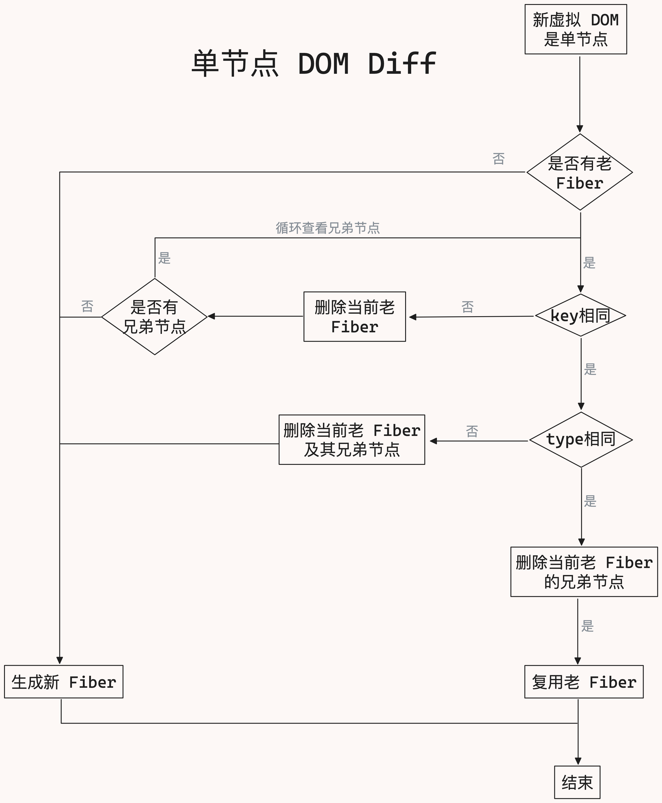
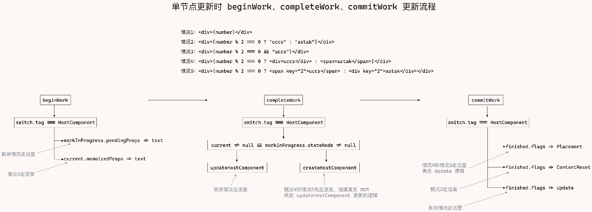

在 `React` 引入 `Fiber` 架构之前，`DOM Diff` 是比较新老虚拟 `DOM`，在引入 `Fiber` 架构后，`DOM Diff` 变成了比较老 `Fiber` 节点和新虚拟 `DOM`

- `React` 老版本
  - 渲染过程：虚拟 `DOM` -> 真实 `DOM` -> 挂载到容器节点
  - 更新过程：新的虚拟 `DOM` -> 真实 `DOM` -> 挂载到容器节点
- `React@18`
  - 渲染过程：虚拟 `DOM` -> `Fiber` 节点 -> 真实 `DOM` -> 挂载到容器节点
  - 更新过程：新的虚拟 `DOM` -> 新的 `Fiber` 节点 -> 真实 `DOM` -> 挂载到容器节点

老版本中 `DOM Diff` 是比较新老虚拟 `DOM`

新版本中 `DOM Diff` 是比较老 `Fiber` 节点和新虚拟 `DOM`，如果满足条件，就可以复用老 `Fiber` 节点

通过前面的学习，我们知道了 `react@18` 渲染分成了三个步骤：`beginWork`、`completeWork`、`commitWork`

虚拟 `DOM` 变成 `Fiber` 节点的过程是在 `beginWork` 中完成的，所以 `DOM Diff` 是发生在 `beginWork` 阶段

然后在 `completeWork` 阶段收集 `updateQueue`，最后在 `commitWork` 阶段将 `updateQueue` 中的 `Fiber` 节点更新到真实 `DOM` 上

## DOM Diff

`react` 节点分为单节点和多节点

下面所说的节点都是更新时候的节点，也就是 `parent` 节点下新的 `child` 节点是一个还是多个

单节点有三种情况：

1. 文本节点的更新
   ```js
   <div className="parent">{number}</div>
   ```
2. 通过条件判断更新节点
   ```js
   <div className="parent">
     {number % 2 !== 0 && <div className="child">{number}</div>}
   </div>
   ```
3. 三元条件判断更新节点
   ```js
   <div className="parent">
     {number % 2 !== 0 ? (
       <div className="child-1">{number}</div>
     ) : (
       <div className="child-2">{number}</div>
     )}
   </div>
   ```

其他情况都是多节点，比如：

1. 文本节点的更新
   ```js
   <div className="parent">age: {age}</div>
   ```
2. 通过条件判断更新节点
   ```js
   <div className="parent">
     <div className="child-1">age:</div>
     {age % 2 !== 0 && <div className="child-2">{age}</div>}
   </div>
   ```

多节点的情况，在 `jsx` 转换成虚拟 `DOM` 的时候，会被处理成数组，也就是多节点的形式

所以 `DOM Diff` 在处理时要分为单节点和多节点

在前面 `beginWork` 中，我们对节点的处理是分为单节点和多节点的，单节点由 `reconcileSingleElement` 处理，多节点由 `reconcileChildrenArray` 处理

之前我们只实现了初始渲染时虚拟 `DOM` 转换成 `Fiber` 的逻辑，现在我们要实现更新时将新的虚拟 `DOM` 转换 `Fiber` 的逻辑

```js
// react-reconciler/src/ReactChildFiber.js
function reconcileChildFibers(returnFiber, currentFirstFiber, newChild) {
  // 处理单个节点
  /**
   * 通过三个条件
   * 1. typeof newChild === "object"
   * 2. newChild !== null
   * 3. newChild.$$typeof === REACT_ELEMENT_TYPE
   */
  if (typeof newChild === "object" && newChild !== null) {
    // 函数组件和原生节点都是这个类型
    switch (newChild.$$typeof) {
      case REACT_ELEMENT_TYPE: {
        return placeSingleChild(
          reconcileSingleElement(returnFiber, currentFirstFiber, newChild)
        );
      }
    }
  }
  // 处理多个节点
  if (Array.isArray(newChild)) {
    return reconcileChildrenArray(returnFiber, currentFirstFiber, newChild);
  }
  return null;
}
```

## DOM Diff 之 beginWork

`beginWork` 的作用就是在更新时根据新的虚拟 `DOM` 找到是否有可以复用的 `Fiber` 节点

主要的实现就是在 `reconcileSingleElement` 和 `reconcileChildrenArray` 中

在进入这两个函数之前，我们需要对节点的更新打个补丁：

下面这种情况，在 `number` 为偶数时，`current.children` 是 `false`，也就是说在 `commitWork` 阶段要把文本清空

```js
<div className="parent">{number % 2 == 0 && "uccs"}</div>
```

我们需要在 `beginWork` 阶段时对节点进行标记

处理单节点时的落脚点都是在 `HostComponent` 分支中，我们就对这个分支增加更新逻辑

```js
function updateHostComponent(current, workInProgress) {
  const { type } = workInProgress;
  const prevProps = current !== null ? current.memoizedProps : null;
  const isDirectTextChild = shouldSetTextContent(type, nextProps);
  // workInProgress.pendingProps.children 是个文本都会走这个逻辑
  if (isDirectTextChild) {
    nextChildren = null;
  } else if (prevProps !== null && shouldSetTextContent(type, prevProps)) {
    // 如果 workInProgress.pendingProps.children 不是文本，但是 prevProps 是文本，表示老的文本需要被清空
    workInProgress.flags |= ContentReset;
  }
}
```

### reconcileSingleElement

我们先来看一下 `reconcileSingleElement` 函数，初始渲染时直接调用 `createFiberFromElement` 创建 `Fiber`

```js
// react-reconciler/src/ReactChildFiber.js
function reconcileSingleElement(returnFiber, currentFirstChild, element) {
  // 将虚拟 DOM 转换成 fiber，这个虚拟 DOM 就是 element
  const created = createFiberFromElement(element);
  // 将 fiber 和 returnFiber 关联起来
  // 因为 returnFiber 是父节点，所以 created 的父节点就是 returnFiber
  created.return = returnFiber;
  // 返回 fiber
  return created;
}
```

那现在更新时，就需要比较新的虚拟 `DOM` 节点和老的 `Fiber` 节点

具体怎么比较呢？

1. 先看下当前是否有老 `Fiber`
2. 如果没有老 `Fiber` 则直接创建新的 `Fiber`
3. 如果有老 `Fiber`，再看下新的虚拟 `DOM` 和老 `Fiber` 的 `key` 是否相同
4. 如果 `key` 不相同，则删除当前的老 `Fiber`，循环调用当前 `Fiber` 的兄弟节点，最后创建新的 `Fiber`
5. 如果 `key` 相同，则再看下新的虚拟 `DOM` 和老 `Fiber` 的 `type` 是否相同
6. 如果 `type` 相同，先删除当前的老 `Fiber` 的兄弟 `Fiber`，再复用当前的老 `Fiber`
7. 如果 `type` 不相同，则删除当前老 `Fiber` 及其兄弟 `Fiber`

具体流程如下图所示：



这里要重点解释下 `2` 个问题：

1. **为什么 `key` 不相同时，需要挨个检查 `Fiber` 的兄弟 `Fiber`，而 `type` 不相同时，直接删除当前 `Fiber` 及其兄弟 `Fiber`，不挨个检查下呢？**

因为用 `key` 的大部分场景是列表，传入 `key` 是为了更方便的复用 `Fiber`，而 `type` 本身就是 `DOM` 节点，`DOM` 节点都发生了变化就没有必要在复用了，直接删除就行

2. 这里的删除不是真删除，这里删除是一种删除状态，真正的删除等到 `commitWork` 阶段

```js
// react-reconciler/src/ReactChildFiber.js
// returnFiber 是父节点，也就是 workInProgress
// currentFirstChild 是第一个子 Fiber，也就是 current.child
// element 是新的虚拟 dom，也就是 current.updateQueue 中的 element
function reconcileSingleElement(returnFiber, currentFirstChild, element) {
  const key = element.key;
  let child = currentFirstChild;
  // 是否有老 Fiber
  // child 是老 Fiber
  while (child !== null) {
    // 老 Fiber 的 key 和新虚拟 DOM 的 key 是否相同
    // key 相同
    if (child.key === key) {
      // 老 Fiber 的 type 和新虚拟 DOM 的 type 是否相同
      // type 相同
      if (child.type === element.type) {
        // 删除当前 Fiber 的兄弟 Fiber
        deleteRemainingChildren(returnFiber, child.sibling);
        // 复用当前 Fiber
        const existing = useFiber(child, element.props);
        existing.return = returnFiber;
        return existing;
      } else {
        // type 不相同，删除当前的 Fiber 及其兄弟 Fiber
        deleteRemainingChildren(returnFiber, child);
      }
    } else {
      // key 不相同，删除当前的 child
      deleteChild(returnFiber, child);
    }
    // 循环兄弟节点
    child = child.sibling;
  }

  // 将虚拟 DOM 转换成 fiber，这个虚拟 DOM 就是 element
  const created = createFiberFromElement(element);
  // 将 fiber 和 returnFiber 关联起来
  // 因为 returnFiber 是父节点，所以 created 的父节点就是 returnFiber
  created.return = returnFiber;
  // 返回 fiber
  return created;
}
```

### reconcileChildrenArray

`react` 在处理多节点时，使用了 `3` 套方案

我们在初始渲染时已经实现过一套方案，这套方案就是遍历节点数组，然后将每个节点都创建成 `Fiber`，并通过 `siblings` 将它们关联起来

```js
// react-reconciler/src/ReactChildFiber.js
function reconcileChildrenArray(returnFiber, currentFirstChild, newChildren) {
  let resultingFirstChild = null;
  let previousNewFiber = null;
  let newIdx = 0;
  for (; newIdx < newChildren.length; newIdx++) {
    const newFiber = createChild(returnFiber, newChildren[newIdx]);
    if (newFiber === null) continue;
    placeChild(newFiber, newIdx);
    if (previousNewFiber === null) {
      resultingFirstChild = newFiber;
    } else {
      previousNewFiber.sibling = newFiber;
    }
    previousNewFiber = newFiber;
  }
  // 返回第一个 child
  return resultingFirstChild;
}
```

在更新阶段就不能这么处理了，需要根据新老节点的 `key` 和 `type` 来判断是否可以复用 `Fiber`

多节点方式一：

```js
<div className="parent">
  {number % 2 === 0 && "astak"}
  multiple-fiber
  {number % 2 === 1 && "uccs"}
</div>
```

### 前置知识

```js
<div className="parent">
  {number % 2 === 0 && "astak"}
  multiple-fiber
  {number % 2 === 1 && "uccs"}
</div>
```

对于上面这种节点，我们在页面只会看到两个节点：

- 初次渲染时：`multiple-fiber` 和 `uccs`
- 更新时：`astak` 和 `multiple-fiber`

但在 `fiber` 中它是三个 `fiber`：

- 初次渲染时：`false`、`multiple-fiber`、`uccs`
- 更新时：`astak`、`multiple-fiber`、`false`

在初次渲染时 `newChildren` 是 `[false, "multiple-fiber", "uccs"]`，在进入 `placeChild` 函数时，`multiple-fiber` 的 `index` 是 `1`，`uccs` 的 `index` 是 `2`

也就是说 `Fiber.index` 是根据虚拟 `DOM` 的顺序，从 `0` 开始递增的

`react` 在更新会采用三套方案，如果满足任意一种方案，`DOM Diff` 就会结束

方案一在初始渲染时不会生效，因为没有 `oldFiber`，会直接走方案二，方案二就是基于虚拟 `DOM` 创建新的 `Fiber`

在更新时，方案一只会在新老节点个数相同的情况下生效

当然如果新老节点个数不一样，也会进入方案一，但是在进入方案一后不满足条件会跳出方案一，然后根据相应的条件要么进入方案二，要么进入方案三

### 方案一

方案一在新老节点个数不一致时，是没法完成 `DOM Diff` 的，还需要方案二和方案三老配合

那什么时候会进入方案二和方案三呢？

方案一在做 `DOM Diff` 过程中是按照新节点的顺序一个个和老节点进行比较

当比较到新节点没有对应的老节点时，或者老节点存在但没有对应的新节点时，就会跳出方案一

1. 新节点没有对应的老节点，`<div>3</div>` 没有对应的老节点，就会跳出方案一，进入方案二
   ```js
   // 更新前
   <div className="parent">
     <div>1</div>
     <div>2</div>
   </div>
   // 更新后
   <div className="parent">
     <div>1</div>
     <div>2</div>
     <div>3</div>
   </div>
   ```
2. 新节点是 `false` 或者新节点和老节点的 `$$typeof` 和 `key` 不一样时，会跳出方案一，进入方案三
   ```js
   // 更新前
   <div className="parent">
     <div>1</div>
     <div>2</div>
     <div>3</div>
   </div>
   // 更新后
   <div className="parent">
     <div>1</div>
     // 虚拟dom 这里会有个 false
     <div>2</div>
   </div>
   // 更新前
   <div className="parent">
     <div>1</div>
     <div>2</div>
     <div>3</div>
   </div>
   // 更新后
   <div className="parent">
     <div>1</div>
     <A />
     <div>2</div>
   </div>
   ```

我们来看具体的代码：

```js
// react-reconciler/src/ReactChildFiber.js
function reconcileChildrenArray(returnFiber, currentFirstChild, newChildren) {
  let resultingFirstChild = null;
  // 上一个 child
  let previousNewFiber = null;
  let newIdx = 0;

  let oldFiber = currentFirstChild;
  let nextOldFiber = null;
  let lastPlacedIndex = 0;
  // 遍历 newChildren
  // 如果 oldFiber 不存在则退出循环
  for (; oldFiber !== null && newIdx < newChildren.length; newIdx++) {
    // oldFiber.index > newIdx，表示更新前的虚拟 DOM 有 false 节点
    // 更新前          ->  更新后
    // [false, a, b]  ->  [b, a, false]
    if (oldFiber.index > newIdx) {
      nextOldFiber = oldFiber;
      oldFiber = null;
    } else {
      // 如果新节点比老节点多，oldFiber.sibling 为 null，表示已经没有老节点了
      // 最后的 oldFiber 会等于 null，退出循环
      nextOldFiber = oldFiber.sibling;
    }
    // 是否复用老 fiber，由 updateSlot 函数决定
    // newFiber 什么时候为 null
    // 1. 新节点是个 false
    // 2. 新节点和老节点的类型(这个类型是指 $$typeof 的类型，不是 div/span 的类型)不同或者 key 不一样时
    const newFiber = updateSlot(returnFiber, oldFiber, newChildren[newIdx]);
    // newFiber 为 null 时跳出循环
    if (newFiber === null) {
      if (oldFiber === null) {
        oldFiber = nextOldFiber;
      }
      break;
    }
    if (shouldTrackSideEffects) {
      if (oldFiber && newFiber.alternate === null) {
        deleteChild(returnFiber, oldFiber);
      }
    }
    // placeChild 函数的作用如果这个节点可以复用就会返回这个节点的 index，否则表示这个节点需要新创建
    lastPlacedIndex = placeChild(newFiber, lastPlacedIndex, newIdx);
    if (previousNewFiber === null) {
      resultingFirstChild = newFiber;
    } else {
      previousNewFiber.sibling = newFiber;
    }
    previousNewFiber = newFiber;
    oldFiber = nextOldFiber;
  }
  // 当第一套方案没有处理完成时，这时 newIdx 是不等于 newChildren.length
  if (newIdx === newChildren.length) {
    deleteRemainingChildren(returnFiber, oldFiber);
    return resultingFirstChild;
  }
}
```

### 方案二

什么时候会进入方案二？

新节点比老节点多，且老节点已经没有了，也就是 `oldFiber === null` 时

```js
// 第二套方案，初始渲染会直接走这一套方案
// 更新时，如果新节点的个数比老节点多，且新节点没有对应的老节点时，oldFiber 为 null，则进入这里
if (oldFiber === null) {
  // newChildren 是一个数组，遍历 newChildren
  for (; newIdx < newChildren.length; newIdx++) {
    // 创建一个 fiber
    const newFiber = createChild(returnFiber, newChildren[newIdx]);
    if (newFiber === null) continue;
    // 每个 fiber 都有一个 index 属性，表示当前 fiber 在父节点中的位置
    lastPlacedIndex = placeChild(newFiber, lastPlacedIndex, newIdx);
    // 将每个 child 用链表的形式连接起来
    // 如果 previousNewFiber 为 null，说明现在遍历的是第一个 child，把它赋值给 resultingFirstChild
    if (previousNewFiber === null) {
      resultingFirstChild = newFiber;
    } else {
      // previousNewFiber 不为 null，说明现在遍历的不是第一个 child，将它和上一个 child 连接起来，形成链表
      // sibling 属性指向下一个 child
      previousNewFiber.sibling = newFiber;
    }
    previousNewFiber = newFiber;
  }
  return resultingFirstChild;
}
```

### 方案三

方案三是在处理完方案一后，如果还有剩余的新节点，就会进入方案三，之后的节点需要仔细比对

什么情况会进入方案三？

1. 新节点是 `false`
2. 新节点的 `$$typeof` 和 `key` 和老节点不一样

```js
// 第三套方案
// 方案一跳出时，进入方案三时，表示之后的节点没法完全复用，需要仔细比对
// oldFiber 就是已经处理到的节点，之后的节点还没有被处理
// newIdx 是已经处理到的新节点的索引
const existingChildren = mapRemainingChildren(returnFiber, oldFiber);
for (; newIdx < newChildren.length; newIdx++) {
  const newFiber = updateFromMap(
    existingChildren,
    returnFiber,
    newIdx,
    newChildren[newIdx]
  );
  if (newFiber !== null) {
    if (shouldTrackSideEffects) {
      if (newFiber.alternate !== null) {
        existingChildren.delete(newFiber.key === null ? newIdx : newFiber.key);
      }
    }
    lastPlacedIndex = placeChild(newFiber, lastPlacedIndex, newIdx);
    if (previousNewFiber === null) {
      resultingFirstChild = newFiber;
    } else {
      previousNewFiber.sibling = newFiber;
    }
    previousNewFiber = newFiber;
  }
}

if (shouldTrackSideEffects) {
  existingChildren.forEach((child) => deleteChild(returnFiber, child));
}

// 返回第一个 child
return resultingFirstChild;
```

### placeChild

`placeChild` 函数主要作用是：判断当前的 `newFiber` 是否是复用的节点，如果是复用的节点，就返回这个节点的 `index` 作为 `lastPlacedIndex`

```js
// 每个 fiber 都有一个 index 属性，表示当前 fiber 在父节点中的位置
// 如果是个复用的 fiber，current 存在，且 current.index > lastPlacedIndex，否则表示这个节点需要新创建，也可能是移动（移动也是创建）
function placeChild(newFiber, lastPlacedIndex, newIdx) {
  newFiber.index = newIdx;
  if (!shouldTrackSideEffects) {
    return lastPlacedIndex;
  }
  const current = newFiber.alternate;
  if (current !== null) {
    const oldIndex = current.index;
    if (oldIndex < lastPlacedIndex) {
      newFiber.flags |= Placement;
      return lastPlacedIndex;
    } else {
      // 复用节点，返回复用节点的 index
      return oldIndex;
    }
  } else {
    newFiber.flags |= Placement;
    return lastPlacedIndex;
  }
}
```

### updateSlot

`updateSlot` 函数的主要作用是：调用 `updateTextNode` 或者 `updateElement` 函数，如果 `Fiber` 能够复用就复用，不能够复用就创建一个新的 `Fiber`

```js
function updateSlot(returnFiber, oldFiber, newChild) {
  const key = oldFiber !== null ? oldFiber.key : null;
  if (
    (typeof newChild === "string" && newChild !== "") ||
    typeof newChild === "number"
  ) {
    if (key !== null) return null;
    return updateTextNode(returnFiber, oldFiber, "" + newChild);
  }

  if (newChild !== null && typeof newChild === "object") {
    switch (newChild.$$typeof) {
      case REACT_ELEMENT_TYPE: {
        if (newChild.key === key) {
          return updateElement(returnFiber, oldFiber, newChild);
        }
      }
      default:
        return null;
    }
  }
  return null;
}
```

### updateFromMap

`updateFromMap` 函数的主要作用是：和 `updateSlot` 函数功能差不多，从 `existingChildren` 中找到相应的 `Fiber`，然后调用 `updateTextNode` 或者 `updateElement` 函数，如果 `Fiber` 能够复用就复用，不能够复用就创建一个新的 `Fiber`

```js
// react-reconciler/src/ReactChildFiber.js
function updateFromMap(existingChildren, returnFiber, newIdx, newChild) {
  // 文本 Fiber
  if (
    (typeof newChild === "string" && newChild !== "") ||
    typeof newChild === "number"
  ) {
    const matchedFiber = existingChildren.get(newIdx) || null;
    return updateTextNode(returnFiber, matchedFiber, `${newChild}`);
  }
  // div/span Fiber
  if (typeof newChild === "object" && newChild !== null) {
    switch (newChild.$$typeof) {
      case REACT_ELEMENT_TYPE: {
        const matchedFiber =
          existingChildren.get(newChild.key === null ? newIdx : newChild.key) ||
          null;
        return updateElement(returnFiber, matchedFiber, newChild);
      }
    }
  }
  return null;
}
```

### updateTextNode

`updateTextNode` 函数的主要作用是：如果 `current` 存在，就复用 `Fiber`，否则就创建一个新的 `Fiber`

```js
// react-reconciler/src/ReactChildFiber.js
function updateTextNode(returnFiber, current, textContent) {
  if (current === null || current.tag !== HostText) {
    const created = createFiberFromText(textContent);
    created.return = returnFiber;
    return created;
  } else {
    const existing = useFiber(current, textContent);
    existing.return = returnFiber;
    return existing;
  }
}
```

### updateElement

`updateElement` 函数的主要作用是：如果 `current` 存在，且 `current.type === element.type`，就复用 `Fiber`，否则就创建一个新的 `Fiber`

```js
// react-reconciler/src/ReactChildFiber.js
function updateElement(returnFiber, current, element) {
  const elementType = element.type;
  if (current !== null) {
    if (current.type === elementType) {
      const existing = useFiber(current, element.props);
      existing.return = returnFiber;
      return existing;
    }
  }
  const created = createFiberFromElement(element);
  created.return = returnFiber;
  return created;
}
```

## DOM Diff 之 completeWork

在 `beginWork` 处理结束后，就进入 `completeWork`，这个函数在更新时的处理逻辑就是 `Fiber` 是复用的就走更新逻辑，如果 `Fiber` 是新创建的就走创建逻辑

我们先来看下单节点，总结来说 `4` 种情况

```js
// 情况1
<div className="parent">{number}</div>
// 情况2
<div className="parent">{number % 2 === 0 ? "uccs" : "astak"}</div>
// 情况3
<div className="parent">{number % 2 === 0 && "uccs"}</div>
// 情况4
<div className="parent">{number % 2 === 0 ? <div>uccs</div> : <span>astak</span>}</div>
```

这 `4` 种情况中，`情况1`、`情况2`、`情况3` 进入的逻辑是一样的走的都是更新逻辑，`情况4` 走的是新建逻辑，再走更新逻辑

因为 `情况4` 中会创建一个新的 `div` 节点，所以就会先走创建的逻辑，先将 `div` 或者 `span` 创建出来，然后再走更新逻辑，将创建好的 `DOM` 添加到 `div.parent` 中

单节点的处理最终的落脚点都在 `HostComponent` 分支中，我们就对这个分支增加更新逻辑

更新逻辑是通过判断 `current` 和 `workInProgress.stateNode` 是否存在，如果存在就走更新逻辑

```js
current !== null && workInProgress.stateNode !== null;
```

最终的代码如下：

```js
function completeWork(current, workInProgress) {
  const newProps = workInProgress.pendingProps;
  switch (workInProgress.tag) {
    case HostComponent:
      const { type } = workInProgress;
      if (current !== null && workInProgress.stateNode !== null) {
        updateHostComponent(current, workInProgress, type, newProps);
      } else {
        const instance = createInstance(type, newProps, workInProgress);
        appendAllChildren(instance, workInProgress);
        workInProgress.stateNode = instance;
        finalizeInitialChildren(instance, type, newProps);
      }
      bubbleProperties(workInProgress);
      break;
    default:
      break;
  }
  return null;
}
```

更新逻辑就是比较 `current.memoizedProps` 和 `workInProgress.pendingProps` 的差异，如果 `workInProgress.pendingProps` 有变化，就将 `workInProgress.pendingProps` 保存到 `updateQueue` 中

到此为止 `completeWork` 都处理完成了，接下来进入 `commitWork` 阶段，进行处理

#### updateHostComponent

`updateHostComponent` 函数接收 `4` 个参数：

- `current`：构建完成的 `fiber` 树
- `workInProgress`：是构建中的 `fiber` 树
- `type`：真实的标签名
- `newProps`：需要更新的 `props`

这个函数主要功能就是从 `workInProgress.pendingProps` 和 `current.memoizedProps` 找出差异，然后将这个差异挂载到 `workInProgress.updateQueue` 上，等待 `commitWork` 阶段的更新，并将 `flags` 设置为 `Update`

```js
// react-reconciler/src/ReactFiberCompleteWork.js
// 将 workInProgress.pendingProps 和 current.memoizedProps 比较，找出两个 props 之间的区别，保存到 workInProgress.updateQueue 中
function updateHostComponent(current, workInProgress, type, newProps) {
  const oldProps = current.memoizedProps;
  const instance = workInProgress.stateNode;
  const updatePayload = prepareUpdate(instance, type, oldProps, newProps);
  workInProgress.updateQueue = updatePayload;
  if (updatePayload) {
    workInProgress.flags |= Update;
  }
}
```

## DOM Diff 之 commitWork

`commitWork` 在处理单节点时落脚点也是在 `HostComponent` 中，主要分为三种处理方式：

1. `DOM` 节点是新增，也就是 `Placement`
2. `DOM` 节点中的文本内容变成空，也就是 `ContentReset`
3. `DOM` 节点是更新，也就是 `Update`

之前我们只处理了 `Placement`，现在我们要处理 `ContentReset` 和 `Update`

看下当前 `finishedWork.flags` 的值，如果是 `ContentReset`，就调用 `resetTextContnt` 将文本节点设置为空；如果是 `Update`，就调用 `commitUpdate` 更新 `DOM` 节点

代码如下：

```js
// react-reconciler/src/ReactFiberCommitWork.js
function commitMutationEffectsOnFiber(finishedWork, root) {
  const flags = finishedWork.flags;
  const current = finishedWork.alternate;
  switch (finishedWork.tag) {
    case HostComponent: {
      // 递归处理 Fiber 树
      recursivelyTraverseMutationEffects(root, finishedWork);
      // 处理新建的 DOM 节点
      commitReconciliationEffects(finishedWork);
      const instance = finishedWork.stateNode;
      // 将文本节点设置为空
      if (finishedWork.flags & ContentReset) {
        resetTextContent(instance);
      }
      // 处理更新的 DOM 节点
      if (flags & Update) {
        if (instance !== null) {
          const newProps = finishedWork.memoizedProps;
          const type = finishedWork.type;
          const updatePayload = finishedWork.updateQueue;
          const oldProps = current !== null ? current.memoizedProps : newProps;
          finishedWork.updateQueue = null;
          if (updatePayload !== null) {
            commitUpdate(instance, updatePayload, type, oldProps, newProps);
          }
        }
      }
      break;
    }
  }
}
```

## 流程图

单节点的更新流程，如果下图所示：



## 工具函数

这些工具函数都是完成单一事情的函数，封装起来等待调用

### deleteChild

```js
// react-reconciler/src/ReactChildFiber.js
function deleteChild(returnFiber, childToDelete) {
  if (!shouldTrackSideEffects) return;
  // deletions
  const deletions = returnFiber.deletions;
  // 把删除的节点保存到 deletions 数组中
  if (deletions === null) {
    returnFiber.deletions = [childToDelete];
    // 将节点的 flags 设置为 ChildDeletion，表示这个节点的子 Fiber 需要被删除
    returnFiber.flags |= ChildDeletion;
  } else {
    returnFiber.deletions.push(childToDelete);
  }
}
```

### deleteRemainingChildren

```js
// react-reconciler/src/ReactChildFiber.js
// returnFiber 是父 Fiber，也就是 workInProgress
// currentFirstChild 老 Fiber
function deleteRemainingChildren(returnFiber, currentFirstChild) {
  if (!shouldTrackSideEffects) return;
  let childToDelete = currentFirstChild;
  // 循环 currentFirstChild.sibling
  while (childToDelete !== null) {
    // 循环调用 deleteChild，删除子节点
    deleteChild(returnFiber, childToDelete);
    childToDelete = childToDelete.sibling;
  }
  return null;
}
```

### useFiber

```js
// react-reconciler/src/ReactChildFiber.js
// fiber 是老 Fiber
// pendingProps 是新的 props
// 复用老 Fiber，但是 props 要用最新的
function useFiber(fiber, pendingProps) {
  // 复用 fiber
  const clone = createWorkInProgress(fiber, pendingProps);
  clone.index = 0;
  clone.sibling = null;
  return clone;
}
```

### prepareUpdate

`prepareUpdate` 函数只是做了一个转发，找出 `newProps` 和 `oldProps` 交给 `diffProperties`

```js
// react-dom-bindings/src/client/ReactDOMHostConfig.js
function prepareUpdate(domElement, type, oldProps, newProps) {
  return diffProperties(domElement, type, oldProps, newProps);
}
```

### diffProperties

`diffProperties` 分别对 `lastProps` 和 `nextProps` 处理，需要更新的 `props` 放入 `updatePayload` 中，它的结构是：

```js
// null 不是需要删除
// 样式属性直接置为 ""
["zhangsan", null, "xiaohong", "女", "style", { color: "" }];
```

`props` 的处理分为两步：

1. 先处理需要删除的 `propKey`，比如下面这样的代码：
   ```js
   const obj1 = { zhangsan: "男" };
   const obj2 = { xiaohong: "女" };
   <div {...(condition ? obj1 : obj2)}></div>;
   ```
2. 再处理需要修改的 `propKey`
   - 先处理 `lastProps` 中的 `style` 属性，如果有需要删除的属性，放入 `styleUpdates` 中，并将它的属性设置为 `""`
   - 再处理 `nextProps` 中的 `style` 属性，找到需要更新的属性，放入 `styleUpdates` 中，将它的属性设置为最新的值
   - `style` 处理完了之后，在处理 `children`，`children` 处理完了之后再处理其他属性，如果有变化，就行需要修改的属性放入 `updatePayload` 中
   - 直到所有属性都处理完了之后，如果存在 `styleUpdates`，将 `styleUpdates` 放入 `updatePayload` 中

## 源码

1. [reconcileSingleElement](https://github.com/astak16/react-source/blob/f3b7880e7bd5600357988a0b6d06100eec7c4cd2/react18-core/packages/react-reconciler/src/ReactChildFiber.js#L56)
2. [reconcileChildrenArray](https://github.com/astak16/react-source/blob/f3b7880e7bd5600357988a0b6d06100eec7c4cd2/react18-core/packages/react-reconciler/src/ReactChildFiber.js#L215)
