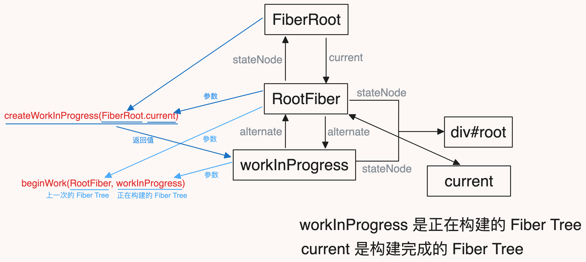
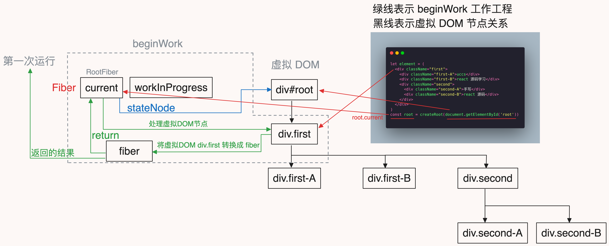

`workInProgress` 上一篇没有讲清楚，这里在补充下：

`fiber` 树始终有两颗：

1. 构建中的 `fiber` 树：`workInProgress`
2. 构建完成的 `fiber` 树：`current`

`workInProgress` 是构建中的 `fiber` 树，`current` 是构建完成的 `fiber` 树

他们通过 `alternate` 属性相互关联

```js
current.alternate = workInProgress;
workInProgress.alternate = current;
```

这里的 `current` 是 `RootFiber`，也就是 `root.current`

在 `beginWork` 工作之前，我们需要准备一颗 `workInProgress` 树，这颗树是从 `current.alternate` 复制而来的，如果 `current.alternate` 不存在就创建一颗新的 `workInProgress` 树

所以 `workInProgress.alternate` 指向的就是 `current`，关系如下图所示



所以 `beginWork` 函数接收的参数是 `current` 和 `workInProgress`，它需要去对比这两颗树的差异，然后更新 `workInProgress` 树

下面正式进入 `beginWork` 阶段的学习

`beginWork` 函数是 `beginWork` 阶段的入口

## beginWork 函数

上一篇文章讲到 `react` 在调度时，是从根节点开始，逐层向下调用 `beginWork`，完成 `fiber` 树构建

`beginWork` 函数接收的参数是 `current` 和 `workInProgress`，返回下一个构建中的 `fiber`(也就是 `workInProgress`)

```js
function workLoopSync() {
  while (workInProgress !== null) {
    performUnitOfWork(workInProgress);
  }
}
function performUnitOfWork(unitOfWork) {
  // current 是构建完成的 fiber 树
  // workInProgress 是构建中的 fiber 树，就是这里的 unitOfWork
  const current = unitOfWork.alternate;
  let next = beginWork(current, unitOfWork); // beginWork
  if (next === null) {
    completeUnitOfWork(unitOfWork); // completeWork
  } else {
    // next 存在，说明子节点也有 workInProgress，继续循环调用 performUnitOfWork
    workInProgress = next;
  }
}
```

`beginWork` 函数主要功能是对不同 `fiber.tag` 进行不同的处理

这里主要处理三种类型的 `tag`

- `HostRoot`：宿主环境容器节点，比如 `document.getElementById('root')`
- `HostComponent`：主环境常规节点，比如 `div/span`
- `HostText`：宿主环境文本节点

```js
// react-reconciler/src/ReactFiberBeginWork.js
function beginWork(current, workInProgress) {
  // 根据 tag 的类型分别处理
  switch (workInProgress.tag) {
    // 宿主环境容器节点，比如 document.getElementById('root')
    case HostRoot:
      return updateHostRoot(current, workInProgress);
    // 宿主环境常规节点，比如 div/span
    case HostComponent:
      return updateHostComponent(current, workInProgress);
    // 宿主环境文本节点
    case HostText:
      return null;
    default:
      return null;
  }
}
```

这两种 `tag` 分别交给两种方法去处理，`HostText` 节点暂时先不处理：

- `updateHostRoot`
- `updateHostComponent`

## updateHostRoot

`updateHostRoot` 函数主要处理宿主根节点，也就是 `document.getElementById('root')` 对应的 `fiber`，这里是 `RootFiber`

接收两个参数：`current` 和 `workInProgress`，主要做了：

1. 处理当前 `fiber` 的 `updateQueue`
2. 调用 `reconcileChildren` 处理子节点，传入 `current`、`workInProgress`、`nextChildren`
3. 最后返回 `workInProgress.child`，也就是第一个子节点的 `fiber`

```js
function updateHostRoot(current, workInProgress) {
  // 处理 updateQueue 队列
  // 处理结束后 workInProgress.memoizedState 中就有了 lastUpdate 中的 element 属性
  processUpdateQueue(workInProgress);
  const nextState = workInProgress.memoizedState;

  // nextChildren 是 lastUpdate 中的 element 属性
  const nextChildren = nextState.element;
  // reconcileChildren 处理结束后，workInProgress.child 中就值了
  reconcileChildren(current, workInProgress, nextChildren);
  // 返回 workInProgress.child，这个 child 是 fiber
  return workInProgress.child;
}
```

由于 `reconcileChildren` 在 `updateHostComponent` 中也有调用，所以这里先不讲，就先看下 `processUpdateQueue` 函数

### processUpdateQueue

`processUpdateQueue` 函数主要处理 `fiber.updateQueue`，也就是 `fiber` 的更新队列

`processUpdateQueue` 接收一个参数：`workInProgress`，也就是工作中的 `fiber` 树

主要做了几件事：

1. 从 `fiber.updateQueue` 中取出 `pending`
2. 如果存在 `pending`，先将 `fiber.updateQueue` 清空
3. 从 `firstPendingUpdate` 开始遍历
   - 从 `updateQueue` 中取出的 `pending` 是 `lastPendingUpdate`
   - `lastPendingUpdate` 是最后进入队列的 `update`
   - `firstPendingUpdate` 是最先进入队列的 `update`，通过 `lastPendingUpdate.next` 获取
   - 将 `lastPendingUpdate.next` 置为 `null`，也就是说断开 `lastPendingUpdate` 和 `firstPendingUpdate` 的联系，是为了在循环遍历 `update` 时不会死循环
     ```
       updateD -> updateA -> updateB -> updateC -> updateD
       🔽
       updateD ❎ updateA -> updateB -> updateC -> updateD
     ```
4. 遍历 `update` 时合并 `fiber.memoizedState` 和 `update.payload`
   - 在初始渲染时 `memoizedState` 是 `null`，`update` 中保存的是`{ payload: { element } }`
   - 合并完之后 `state` 会有 `element` 属性
5. 最后将 `newState` 赋值给 `memoizedState`

```js
// react-reconciler/src/ReactFiberClassUpdateQueue.js
function processUpdateQueue(workInProgress) {
  const queue = workInProgress.updateQueue;
  // 从 updateQueue 中取出 pending
  // 取出的 pending 是 lastPendingUpdate
  const pendingQueue = queue.shared.pending;
  if (pendingQueue !== null) {
    // 取出后，将 updateQueue 清空
    queue.shared.pending = null;
    // lastPendingUpdate 是最后进入队列的 update
    // 链表结构：updateD -> updateA -> updateB -> updateC -> updateD
    const lastPendingUpdate = pendingQueue;
    // firstPendingUpdate 是最先进入队列的 update
    const firstPendingUpdate = lastPendingUpdate.next;
    // 断开 lastPendingUpdate 和 firstPendingUpdate 的联系，是为了在循环遍历 update 时不会死循环
    lastPendingUpdate.next = null;
    let newState = workInProgress.memoizedState;
    // 从 firstPendingUpdate 开始遍历，一直遍历到 lastPendingUpdate
    // 将每个 update 的 payload 合并到 newState 中
    // update 结构是 { payload: { element } }
    // 最后 newState 中有 lastPendingUpdate 中的 element
    let update = firstPendingUpdate;
    while (update) {
      newState = getStateFromUpdate(update, newState);
      update = update.next;
    }
    // 最后将 newState 赋值给 memoizedState
    // workInProgress.memoizedState 是处理后的 state
    workInProgress.memoizedState = newState;
  }
}

function getStateFromUpdate(update, prevState) {
  const { payload } = update;
  return Object.assign({}, prevState, payload);
}
```

## updateHostComponent

`updateHostComponent` 函数主要处理宿主的常规节点，也就是 `div/span` 这种

接收的参数是 `current` 和 `workInProgress`，主要做了：

1. 看下当前节点的子节点是不是文本节点
   - 调用 `shouldSetTextContent` 函数判断当前节点的子节点是不是文本节点
   - 如果是文本节点，将 `nextChildren` 置为 `null`
2. 调用 `reconcileChildren` 处理子节点，传入 `current`、`workInProgress`、`nextChildren`
3. 最后返回 `workInProgress.child`，也就是第一个子节点

```js
// react-reconciler/src/ReactFiberBeginWork.js
function updateHostComponent(current, workInProgress) {
  const { type } = workInProgress;
  const nextProps = workInProgress.pendingProps;
  // children 是在 props 中的
  let nextChildren = nextProps.children;
  // 判断 children 是否是文本节点
  const isDirectTextChild = shouldSetTextContent(type, nextProps);
  // 如果是文本节点，就将 nextChildren 置为 null
  if (isDirectTextChild) {
    nextChildren = null;
  }
  // reconcileChildren 处理结束后，workInProgress.child 中就值了
  reconcileChildren(current, workInProgress, nextChildren);
  // 返回 workInProgress.child，这个 child 是 fiber
  return workInProgress.child;
}

// react-dom-bindings/src/client/ReactDOMHostConfig.js
function shouldSetTextContent(type, props) {
  return (
    // 节点是 string 或者 number 类型，就认为是文本节点
    typeof props.children === "string" || typeof props.children === "number"
  );
}
```

## reconcileChildren

`reconcileChildren` 函数负责协调子节点，接收三个参数：

- `current`：构建完成的 `fiber` 树
- `workInProgress`：构建中的 `fiber` 树
- `nextChildren`：要处理的子节点

解释下要 `nextChildren` 是啥意思：

下面这段代码中，`element` 就是 `nextChildren` 也就是 `div`，`root` 是 `FiberRoot`，`current` 是 `root.current` 也就是 `RootFiber`

```js
const element = <div>uccs</div>;
const root = createRoot(document.getElementById("root"));
root.render(element);
```

`reconcileChildren` 根据 `current` 是否存在，分别调用 `mountChildFibers` 和 `reconcileChildFibers`，这两个函数的作用是协调子节点

`beginWork` 第一次运行时 `current` 是有值的，所以会调用 `reconcileChildFibers`，后面 `beginWork` 运行时 `current` 就是 `null`，所以会调用 `mountChildFibers`

```js
// react-reconciler/src/ReactFiberBeginWork.js
function reconcileChildren(current, workInProgress, nextChildren) {
  if (current === null) {
    workInProgress.child = mountChildFibers(workInProgress, null, nextChildren);
  } else {
    workInProgress.child = reconcileChildFibers(
      workInProgress,
      current.child,
      nextChildren
    );
  }
}
```

`mountChildFibers` 和 `reconcileChildFibers` 是对 `createChildReconciler` 函数的封装

`createChildReconciler` 接收一个参数：

- `shouldTrackSideEffects`：是否需要追踪副作用，`boolean` 类型
  - 如果为 `true` 表示需要追踪副作用，将 `fiber` 标记为 `Placement`，表示需要插入到父节点中

`createChildReconciler` 返回一个函数 `reconcileChildFibers`

`reconcileChildFibers` 函数的作用是比较新老节点的差异，实现 `diff` 算法，然后更新 `newChild`，不过在这里面我们先专注于初始渲染，等之后讲更新时再来实现 `diff` 算法（先忽略 `currentFirstFiber`）

### reconcileChildFibers

`reconcileChildFibers` 函数是 `createChildReconciler` 返回的函数，它接收三个参数：

1. `returnFiber`：父节点，工作中的节点
2. `currentFirstFiber`：老节点的第一个子节点
3. `newChild`：新节点

`reconcileChildFibers` 主要功能：

1. 处理单个子节点，由 `reconcileSingleElement` 函数处理
2. 处理多个子节点，由 `reconcileChildrenArray` 函数处理

```js
// returnFiber 是父节点，也就是 workInProgress
// currentFirstChild 老节点的第一个子节点，也就是 current.child
// newChild 是新的子节点，也就是 current.updateQueue 中的 element
function reconcileChildFibers(returnFiber, currentFirstFiber, newChild) {
  // 处理单个节点
  if (typeof newChild === "object" && newChild !== null) {
    switch (newChild.$$typeof) {
      case REACT_ELEMENT_TYPE: {
        return placeSingleChild(
          // 处理单个节点
          reconcileSingleElement(returnFiber, currentFirstFiber, newChild)
        );
      }
    }
  }
  // 处理多个节点
  if (isArray(newChild)) {
    return reconcileChildrenArray(returnFiber, currentFirstFiber, newChild);
  }
}
```

#### reconcileSingleElement

`reconcileSingleElement` 函数的作用是处理一个子节点，主要功能是：

1. 将虚拟 `DOM` 转换成 `Fiber`
2. 然后将 `Fiber` 和 `returnFiber` 关联起来

```js
// react-reconciler/src/ReactChildFiber.js
// returnFiber 是父节点，也就是 workInProgress
// currentFirstChild 老节点的第一个子节点，也就是 current.child
// newChild 是新的子节点
function reconcileSingleElement(returnFiber, currentFirstChild, element) {
  // 将虚拟 DOM 转换成 fiber，这个虚拟 DOM 就是 element
  const created = createFiberFromElement(element);
  // 将 fiber 和 returnFiber 关联起来
  // 因为 returnFiber 是父节点，所以 created 的父节点就是 returnFiber
  created.return = returnFiber;
  // 返回 fiber
  return created;
}
```

将虚拟 `DOM` 转换成 `Fiber`，是通过 `createFiberFromElement` 函数实现的

创建 `fiber` 非常简单，就是调用 [createFiber](https://github.com/astak16/react-source/blob/1185e18012a4613f0354419899892327b400a9d5/react18-core/packages/react-reconciler/src/ReactFiber.js#L39) 函数，然后将 `fiber.tag` 设置为 `HostComponent`

```js
// react-reconciler/src/ReactFiber.js
function createFiberFromElement(element) {
  const { type, props: pendingProps, key } = element;
  return createFiberFromTypeAndProps(type, key, pendingProps);
}

function createFiberFromTypeAndProps(type, key, pendingProps) {
  // 初始设为未知类型
  let tag = IndeterminateComponent;
  // 如果 type 是 string 类型，就将 tag 设置为 HostComponent
  if (typeof type === "string") {
    tag = HostComponent;
  }
  // 创建 fiber
  const fiber = createFiber(tag, pendingProps, key);
  // 将 type 赋值给 fiber.type
  fiber.type = type;
  return fiber;
}
```

### reconcileChildrenArray

`reconcileChildrenArray` 函数的作用是处理多个子节点，主要功能是：

遍历子节点，把每一个子节点都转换成 `fiber`，然后将 `fiber` 用链表的形式连接起来，最后返回第一个子节点，通过 `sibling` 可以访问当前节点的下一个节点

```js
// react-reconciler/src/ReactChildFiber.js
function reconcileChildrenArray(returnFiber, currentFirstChild, newChildren) {
  // 链表中第一个 child
  let resultingFirstChild = null;
  // 上一个 child
  let previousNewFiber = null;
  let newIdx = 0;
  // newChildren 是一个数组，遍历 newChildren
  for (; newIdx < newChildren.length; newIdx++) {
    // 创建一个 fiber
    const newFiber = createChild(returnFiber, newChildren[newIdx]);
    if (newFiber === null) continue;
    // 每个 fiber 都有一个 index 属性，表示当前 fiber 在父节点中的位置
    placeChild(newFiber, newIdx);
    // 将每个 child 用链表的形式连接起来
    // 如果 previousNewFiber 为 null，说明现在遍历的是第一个 child，把它赋值给 resultingFirstChild
    if (previousNewFiber === null) {
      resultingFirstChild = newFiber;
    } else {
      // previousNewFiber 不为 null，说明现在遍历的不是第一个 child，将它和上一个 child 连接起来，形成链表
      // sibling 属性指向下一个 child
      previousNewFiber.sibling = newFiber;
    }
    previousNewFiber = newFiber;
  }
  // 返回第一个 child
  return resultingFirstChild;
}

// 每个 fiber 都有一个 index 属性，表示当前 fiber 在父节点中的位置
function placeChild(newFiber, newIdx) {
  newFiber.index = newIdx;
  if (shouldTrackSideEffects) {
    newFiber.flags |= Placement;
  }
}
```

`createChild` 函数的作用是将子节点转换成 `fiber`

1. 如果子节点是文本，就调用 `createFiberFromText` 函数创建 `fiber`
2. 如果子节点是对象，就调用 `createFiberFromElement` 函数创建 `fiber`
3. 创建完成后，需要将 `fiber.return` 设置为父节点，也就是 `returnFiber`

```js
function createChild(returnFiber, newChild) {
  // 文本节点
  if (
    (typeof newChild === "string" && newChild !== "") ||
    typeof newChild === "number"
  ) {
    const created = createFiberFromText(`${newChild}`);
    // 将 fiber 和 returnFiber 关联起来
    created.return = returnFiber;
    return created;
  }
  // 对象
  if (typeof newChild === "object" && newChild !== null) {
    switch (newChild.$$typeof) {
      case REACT_ELEMENT_TYPE: {
        const created = createFiberFromElement(newChild);
        // 将 fiber 和 returnFiber 关联起来
        created.return = returnFiber;
        return created;
      }
      default:
        break;
    }
  }
  return null;
}
```

## 总结

在 `completeWork` 工作前，`beginWork` 只运行了一次，它主要做的事情：

1. 从虚拟 `DOM` 中取出第一个节点（图中 `div.first`）
2. 将 `div.first` 节点转换成 `fiber`，将 `fiber` 和它的父 `fiber` 关联起来
3. 将这个 `div.first` 对应的 `fiber` 返回出去（`next`）



## 源码

1. [beginWork](https://github.com/astak16/react-source/blob/18f1f1d5db8cb00929426d7b537f2899b80058e8/react18-core/packages/react-reconciler/src/ReactFiberWorkLoop.js#L77)
