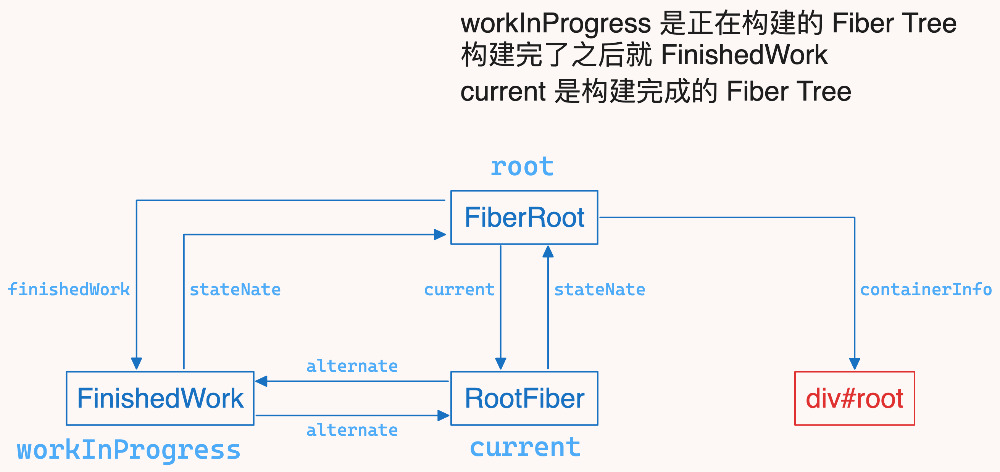
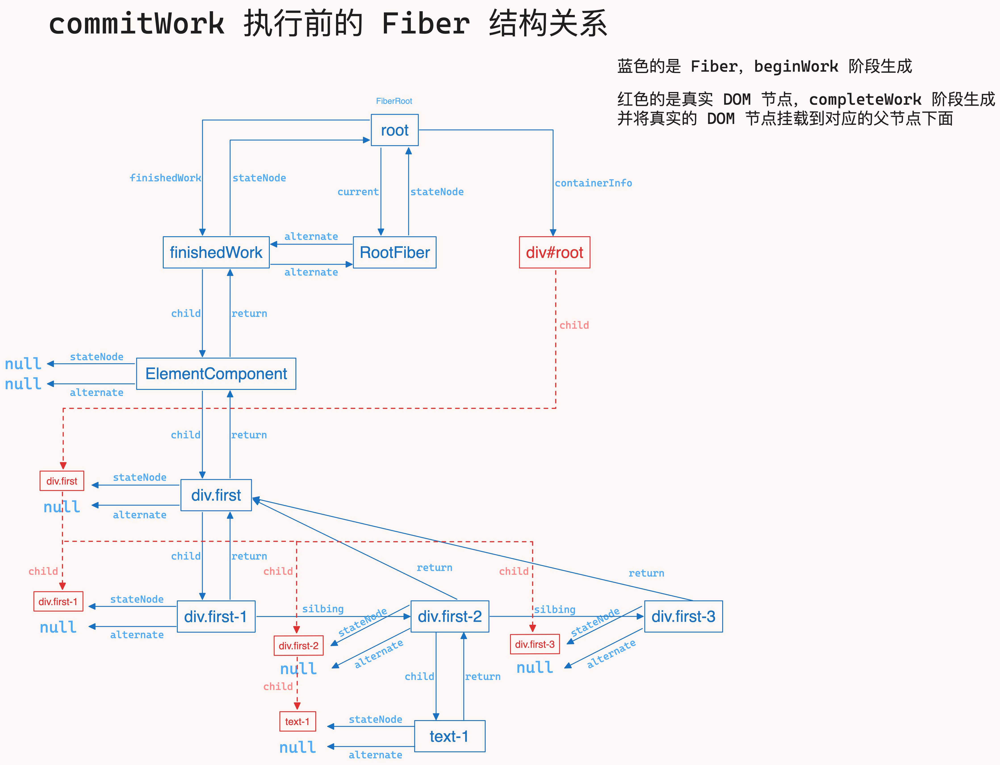
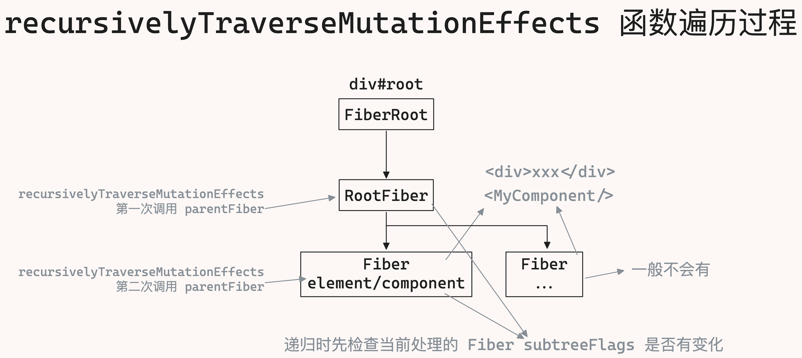
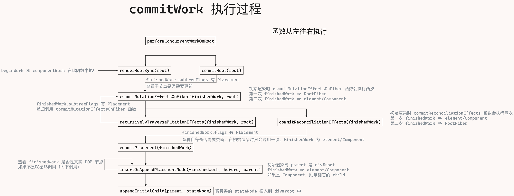

通过 `beginWork` 和 `completeWork` 两张的讲解，我们已经完成渲染阶段的逻辑，接下来将进入提交阶段 `commitWork`

先来总结一下，渲染阶段分为：`beginWork` 和 `completeWork`：

- `beginWork` 的作用是将虚拟 `DOM` 生成 `Fiber`
- `completeWork` 的作用是将 `Fiber` 转换成真实 `DOM`，并将子节点挂载到对应的父节点下面

在实际的执行过程中，`beginWork` 和 `completeWork` 是交替执行的

具体可以查看这两篇文章：

1. [beginWork 工作原理](./beginWork工作原理.md)
2. [completeWork 工作原理](./4张图带你看懂beginWork和completeWork工作过程.md)

在渲染阶段完成之后，就将进入提交阶段，也就是 `commitWork`，`commitWork` 作用是将真实 `DOM` 挂载到页面中

## 获取到已经处理完的 Fiber 树

`commitWork` 是从根节点开始处理，也就是 `FiberRoot`，`FiberRoot` 如下图所示



在得到这个 `Fiber` 树之前，我们需要做如下处理：

1. 从 `root.current` 取出 `alternate`，也就是已经完成处理的 `Fiber` 树
2. 将 `alternate` 赋值给 `finishedWork`，这样在 `commitWork` 阶段就直接使用 `finishedWork` 就可以拿到已经处理完成的 `Fiber` 树了

代码如下所示：

```js
// react-reconciler/src/ReactFiberWorkLoop.js
function performConcurrentWorkOnRoot(root) {
  // beginWork 和 completeWork 在此函数中执行
  renderRootSync(root);
  // 执行到这里时，beginWork 和 completeWork 都已经执行完了
  // alternate 是一颗已经完成处理的 Fiber 树
  // 需要将 alternate 赋值给 finishedWork，这样在 commitWork 阶段就可以拿到已经完成处理的 Fiber 树了
  const finishedWork = root.current.alternate;
  root.finishedWork = finishedWork;
  commitRoot(root); // commitWork 阶段
}
```

最终在 `commitRoot` 开始之前，我们得到的 `Fiber` 树结构，如下图所示



## commitRoot

`commitRoot` 函数接收 `FiberRoot` 作为参数

主要的作用是检查 `RootFiber` 和 `RootFiber.child` 是否有变化，如果有变化就将 `RootFiber` 渲染在页面上

如何检查它的变化呢？

如何检查 `RootFiber` 是否有变化呢？

在 `beginWork` 阶段，如果创建了新的 `Fiber`，就会给这个 `Fiber` 的 `flags` 属性赋值，如果是新增就是 `Placement`

在 `completeWork` 阶段，在处理当前 `Fiber` 时，会将子 `Fiber` 的 `flags` 和 `subtreeFlags` 赋值给当前 `Fiber` 的 `subtreeFlags`

我们就可以直接拿到 `finishedWork.flags` 和 `finishedWork.subtreeFlags`，然后和 `MutationMask` 比较一下就可以知道是否有变化了

根据图中的显示，我们知道 `finishedWork.stateNode` 是 `FiberRoot`，`FiberRoot` 是一个真实节点(`document.getElementById("root")`)，所以它本身不会有变化，也就是 `flags` 为 `0`，但是它的 `subtreeFlags` 是有值的

比较方法是按位与，如果结果不为 `0`，说明有变化，进入 `commitMutationEffectsOnFiber` 函数，代码如下所示

```js
// react-reconciler/src/ReactFiberWorkLoop.js
function commitRoot(root) {
  // 取出已经过 beginWork 和 completeWork 处理过的 Fiber 树
  // 这个 finishedWork 是 RootFiber
  const { finishedWork } = root;
  // 查看 RootFiber 的子 Fiber 是否有处理
  /**
   * Placement:    0b0000000010;
   * MutationMask: 0b0000000110;
   * NoFlags:      0b0000000000;
   *
   *   0b0000000010
   * & 0b0000000110
   * --------------
   *   0b0000000010   !== 0b0000000000
   */
  const subtreeHasEffects =
    (finishedWork.subtreeFlags & MutationMask) != NoFlags;
  // 查看 RootFiber 是否有处理
  const rootHasEffect = (finishedWork.flags & MutationMask) != NoFlags;
  if (subtreeHasEffects || rootHasEffect) {
    // 有处理就进入 commitMutationEffectsOnFiber 函数
    commitMutationEffectsOnFiber(finishedWork, root);
  }
  // 经过 commitWork 处理后，将替换页面中的 RootFiber
  root.current = finishedWork;
}
```

### flags 和 subtreeFlags 赋值

我们来回顾一下 `beginWork` 阶段，`flags` 是怎么赋值的

在 `beginWork` 阶段，只给 `div#root` 节点下的第一个子节赋值 `flags`，代码如下所示

这么做是为了优化性能，因为在初始渲染时，所有的节点都是新增，所以只需要给 `div#root` 节点下的第一个子节点(`element` 或者 `Component`)赋值 `flags` 就可以了

```js
// react-reconciler/src/ReactChildFiber.js
function placeSingleChild(newFiber) {
  // beginWork 阶段，只有在处理 div#root 节点时，shouldTrackSideEffects 为 true
  // 这里的 newFiber 是 div#root 的第一个子节点，也就是 element 或者 Component
  if (shouldTrackSideEffects && newFiber.alternate === null) {
    newFiber.flags |= Placement;
  }
  return newFiber;
}
```

然后在 `completeWork` 阶段，收集当前 `Fiber` 的子 `Fiber.flags` 和 `Fiber.subtreeFlags`，由于在初始渲染时，只有 `div#root` 节点下的第一个子节点有 `flags` 值(这里 `React` 并没有做优化)，所以当遍历到 `div#root` 节点时，就会拿到 `element` 或者 `Component` 的 `flags` 值，然后赋值给 `div#root` 节点的 `subtreeFlags`

```js
function bubbleProperties(completedWork) {
  let subtreeFlags = NoFlags;
  let child = completedWork.child;
  while (child !== null) {
    subtreeFlags |= child.subtreeFlags;
    subtreeFlags |= child.flags;
    child = child.sibling;
  }
  completedWork.subtreeFlags = subtreeFlags;
}
```

## commitMutationEffectsOnFiber

`commitWork` 就是从这里开始执行的，从 `RootFiber` 开始，和 `recursivelyTraverseMutationEffects` 一起递归处理各个节点

`commitMutationEffectsOnFiber` 函数内部主要调用了两个函数：

- `recursivelyTraverseMutationEffects`：用来递归处理 `Fiber` 树
- `commitReconciliationEffects`：用来处理自身节点的副作用

`recursivelyTraverseMutationEffects` 函数从根节点开始往下执行，等到 `recursivelyTraverseMutationEffects` 执行结束后，`commitReconciliationEffects` 函数从叶子节点开始往上执行

```bash
# recursivelyTraverseMutationEffects 函数处理节点的顺序
div#root -> element/Component

# commitReconciliationEffects 函数处理节点的顺序
element/Component -> div#root
```

代码如下：

```js
// react-reconciler/src/ReactFiberCommitWork.js
function commitMutationEffectsOnFiber(finishedWork, root) {
  switch (finishedWork.tag) {
    case HostRoot:
    case HostComponent:
    case HostText: {
      // 递归处理 Fiber 树
      recursivelyTraverseMutationEffects(finishedWork);
      // 处理自身节点的副作用
      commitReconciliationEffects(finishedWork);
      break;
    }
  }
}
```

### recursivelyTraverseMutationEffects

`recursivelyTraverseMutationEffects` 接收一个 `Fiber` 作为参数

主要功能是检查 `Fiber.subtreeFlags` 是否有 `MutationMask`，如果有，则说明子元素有变化，需要递归处理子元素

如图所示：



具体的执行过程如下：

1. 函数执行时，首先检查当前 `Fiber.subtreeFlags` 是否有 `MutationMask`
   - 如果有就调用 `commitMutationEffectsOnFiber` 函数，处理 `Fiber.child`，然后检查这个 `child` 是否有兄弟元素，如果有就递归处理它的兄弟元素
   - 如果没有变化就结束递归
2. 第一次进入时 `parentFiber` 是 `RootFiber`，也就是 `div#root` 对应的 `Fiber`
3. 第二次进入时 `parentFiber` 是 `RootFiber.child`，也就是 `element` 或者 `Component` 对应的 `Fiber`
4. 第三次不会进入，因为 `RootFiber.child` 没有 `sibling`，所以递归结束

```js
// react-reconciler/src/ReactFiberCommitWork.js
function recursivelyTraverseMutationEffects(parentFiber) {
  // 查看子 Fiber 是否需要处理
  if (parentFiber.subtreeFlags & MutationMask) {
    let { child } = parentFiber;
    // 如果有子 Fiber 就循环调用 commitMutationEffectsOnFiber
    while (child !== null) {
      // 递归处理 Fiber
      commitMutationEffectsOnFiber(child);
      child = child.sibling;
    }
  }
}
```

### commitReconciliationEffects

`commitReconciliationEffects` 函数的作用是检查自身有没有的 `flags` 有没有 `Placement`，如果有就调用 `commitPlacement` 函数处理当前 `Fiber` 节点，并将 `Placement` 从 `flags` 中删除

`~Placement` 的作用是将 `Placement` 取反，也就是 `0b0000000010` 取反，结果是 `0b1111111101` 然后和 `flags` 做按位与，将 `Placement` 从 `flags` 中删除

```js
// react-reconciler/src/ReactFiberCommitWork.js
function commitReconciliationEffects(finishedWork) {
  const { flags } = finishedWork;
  // 检查自身有没有变化，如果有变化就调用 commitPlacement
  if (flags & Placement) {
    commitPlacement(finishedWork);
    // 处理完后就将 Placement 从 flags 中删除
    finishedWork.flags &= ~Placement;
  }
}
```

## commitPlacement

`commitPlacement` 函数的作用是将 `Fiber` 挂载到页面上

`commitPlacement` 执行的过程是从当前的 `Fiber` 开始找到最近的父 `Fiber`（向上查找，必须是一个真实 `DOM` 的 `Fiber`，如果是 `ComponentFiber`，继续向上查找），然后根据父节点的类型，拿到对应的 `DOM` 节点(父节点)

在初始渲染阶段，`finishedWork` 是 `RootFiber.child`，也就是 `element` 或者 `Component` 对应的 `Fiber`

然后调用 `insertOrAppendPlacementNode` 函数，将 `finishedWork` 插入到 `parent` 中

```js
// react-reconciler/src/ReactFiberCommitWork.js
// 在初始渲染阶段，finishedWork 是 RootFiber.child，也就是 element 或者 Component 对应的 Fiber
// parentFiber 是 RootFiber
function commitPlacement(finishedWork) {
  const parentFiber = getHostParentFiber(finishedWork);
  switch (parentFiber.tag) {
    // 初始渲染会走这里
    case HostRoot: {
      const parent = parentFiber.stateNode.containerInfo;
      insertOrAppendPlacementNode(finishedWork, null, parent);
      break;
    }
  }
}
```

### getHostParentFiber

`getHostParentFiber` 函数的作用是找到当前 `Fiber` 最近的父 `Fiber`(这个父 `Fiber` 必须有真实 `DOM` 节点的 `Fiber`，否者继续向上查找)

如何找到父 `Fiber`

看下 `Fiber.return.tag` 是不是 `HostComponent` 或者 `HostRoot`，如果是说明这个 `Fiber` 有真实的 `DOM` 节点，如果不是就继续往上找

```js
// react-reconciler/src/ReactFiberCommitWork.js
// 从当前 Fiber 向上找到最近有真实 DOM 节点的 Fiber
function getHostParentFiber(fiber) {
  let parent = fiber.return;
  while (parent !== null) {
    if (isHostParent(parent)) {
      return parent;
    }
    parent = parent.return;
  }
}

// react-reconciler/src/ReactFiberCommitWork.js
function isHostParent(fiber) {
  return fiber.tag === HostComponent || fiber.tag === HostRoot;
}
```

### insertOrAppendPlacementNode

`insertOrAppendPlacementNode` 函数的作用是将 `Fiber` 挂载到 `parent` 中，接收三个参数：

- `fiber`：需要挂载的 `Fiber`，初始渲染时是 `element` 或者 `Component` 对应的 `Fiber`
- `before`：需要挂载 `Fiber` 的前一个兄弟节点，初始渲染时为 `null`
- `parent`：`fiber` 的父元素，初始渲染时为 `div#root`

这个函数的主要作用是

1. 判断是不是真实的 `DOM` 节点，如果是就从 `fiber` 中拿到真实的 `DOM` 节点（`stateNode`），并插入到 `parent` 中，在初次渲染时，`before` 是不存在的，所以直接插入到 `parent` 中
2. 如果不是真实的 `DOM` 节点，就递归调用 `insertOrAppendPlacementNode` 函数
   - 如果不是真实的 `DOM` 节点，说明现在处理的是组件，拿到组件的 `child`，然后递归调用 `insertOrAppendPlacementNode` 函数

```js
// react-reconciler/src/ReactFiberCommitWork.js
function insertOrAppendPlacementNode(fiber, before, parent) {
  const isHost = isHostParent(fiber);
  if (isHost) {
    const { stateNode } = fiber;
    if (!before) {
      // stateNode 是一颗完整的树，只需要将它插入到 div#root 中就可以了，也就是这里的 parent
      appendInitialChild(parent, stateNode);
    }
  } else {
    const { child } = fiber;
    if (child !== null) {
      insertOrAppendPlacementNode(child, before, parent);
    }
  }
}
```

调用 `appendInitialChild` 函数将 `node` 插入到 `parent` 中

```js
// react-dom-bindings/src/client/ReactDOMHostConfig.js
function appendInitialChild(parent, child) {
  parent.appendChild(child);
}
```

初始渲染时 `commitWork` 阶段到此就执行完成了，页面已经渲染成功了

## 总结

在初始渲染时，`commitWork` 其实只处理了两个 `Fiber`：`RootFiber` 和 `RootFiber.child`，也就是 `div#root` 和 `element/Component` 对应的 `Fiber`

为什么 `commitWork` 只处理这两个 `Fiber`，就能将页面渲染出来呢？

因为在 `completeWork` 节点，每个 `Fiber` 的真实节点已经被挂载到它的父元素的真实 `DOM` 上了，所以在 `commitWork` 阶段，只需要将 `element/Component` 直接挂载到 `div#root` 上就可以了

`commitWork` 阶段的执行过程如下：



## 源码

1. [commitWork](https://github.com/astak16/react-source/blob/795e0880f5a64d0164be873eef37e55b4242fc72/react18-core/packages/react-reconciler/src/ReactFiberWorkLoop.js#L69)
2. [commitMutationEffectsOnFiber](https://github.com/astak16/react-source/blob/795e0880f5a64d0164be873eef37e55b4242fc72/react18-core/packages/react-reconciler/src/ReactFiberCommitWork.js#L234)
3. [commitReconciliationEffects](https://github.com/astak16/react-source/blob/795e0880f5a64d0164be873eef37e55b4242fc72/react18-core/packages/react-reconciler/src/ReactFiberCommitWork.js#L141)
4. [insertOrAppendPlacementNode](https://github.com/astak16/react-source/blob/795e0880f5a64d0164be873eef37e55b4242fc72/react18-core/packages/react-reconciler/src/ReactFiberCommitWork.js#L189)
