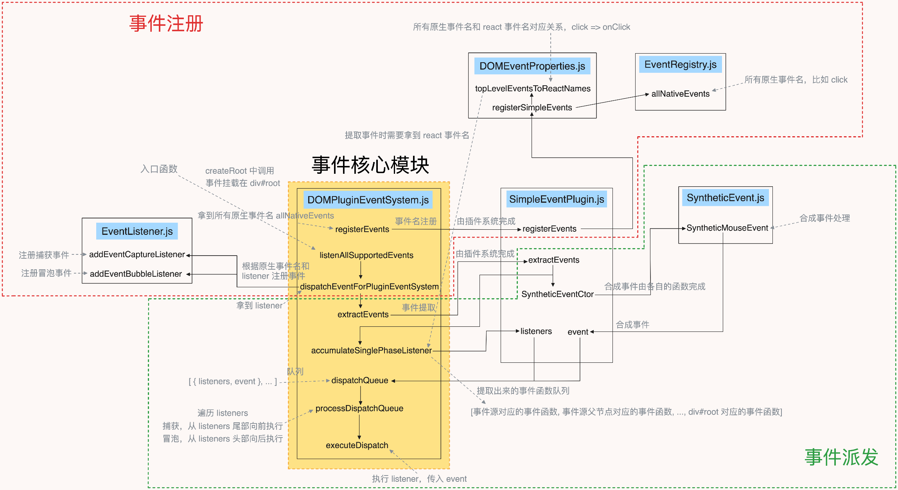

`react` 的合成事件在之前 `simple-react` 中实现过了，在 `fiber` 架构中的合成事件原理和之前是差不多的

只不过 `fiber` 架构中的合成事件在处理上更加复杂一点，把事件分为了两部分：注册和派发

注册时引入了插件机制，每种事件类型由对应的插件完成，注册的结果就是乡全局变量中添加

派发就是：事件触发时，从全局变量中取出对应的事件处理函数，然后执行

合成事件的核心控制放在了 `DOMPluginEventSystem.js` 文件中

事件系统分为两部分**事件注册**和**事件派发**，如下图所示：



## 事件注册

事件注册的入口函数是 `listenAllSupportedEvents`，接收的参数是真实的 `DOM` 节点，这个节点用来绑定事件

调用 `listenAllSupportedEvents` 函数的地方是在 `createRoot` 中，我们传入的参数是 `container`，这个 `container` 是 `div#root`

这和之前在 `simple-react` 中实现的不一样，在 `simple-react` 事件是绑定在 `document` 上的，而在 `fiber` 架构中，事件是绑定在 `div#root` 上

```js
// react-dom/src/client/ReactDOMRoot.js
function createRoot(container) {
  const root = createContainer(container);
  // container 是 div#root，用来绑定事件
  listenAllSupportedEvents(container);
  return new ReactDOMRoot(root);
}
```

在监听事件之前，我们要准备好所有的事件名，所有的事件名哪里来？

在 `simple-react` 中是从属性中提取的，在 `fiber` 架构中事件名是穷举的，具体查看【注册事件名】章节

事件名准备好之后，我们需要调用 `SimpleEventPlugin` 插件完成事件注册

```js
// react-dom-bindings/src/event/DOMPluginEventSystem.js
import * as SimpleEventPlugin from "./plugins/SimpleEventPlugin";
// 原生事件注册
SimpleEventPlugin.registerEvents();
```

这时我们就可以拿到所有的原生事件 `allNativeEvents`，调用 `listenAllSupportedEvents` 完成事件注册，具体查看【`listenAllSupportedEvents`】章节

### 注册事件名

`react` 将事件名穷举放在了 `DOMEventProperties.js` 文件中，定义了一个变量 `simpleEventPluginEvents` 用来保存简单事件名

什么是简单事件？

简单事件是 `onClick` 只依赖了 `click` 事件，而复合事件是由多个事件合成的，比如：`onMouseEnter`，它依赖了 `mouseout` 和 `mouseover`，这里我们只用 `click` 举例

不同类型的事件都有自己的注册插件，这里 `simpleEventPluginEvents` 将会由插件 `SimpleEventPlugin` 完成注册

这个函数主要做了两件事件：

1. 事件名准备
   ```js
   // react-dom-bindings/src/event/DOMEventProperties.js
   // 简单事件，如 onClick 只依赖了 click
   const simpleEventPluginEvents = ["click"];
   ```
2. 事件名处理
   1. 遍历事件名数组，将事件名转换成首字母大写，比如 `click` 转换成 `Click`，在转换成 `onClick`
   2. 调用 `registerSimpleEvent` 函数注册简单事件，具体查看【`registerSimpleEvent`】章节
   ```js
   // react-dom-bindings/src/event/DOMEventProperties.js
   function registerSimpleEvents() {
     // 遍历事件名数组
     for (let i = 0; i < simpleEventPluginEvents.length; i++) {
       const eventName = simpleEventPluginEvents[i];
       // 小写
       const domEventName = eventName.toLowerCase();
       // 首字母大写，click => Click
       const capitalizeEventName = eventName[0].toUpperCase() + eventName.slice(1);
       // 注册事件，传入两个参数：原生事件名 和 react 事件名
       // 原生事件名：click
       // react 事件名：onClick
       registerSimpleEvent(domEventName, `on${capitalizeEventName}`);
     }
   }
   ```
3. 准备两个变量，用来保存原生事件名和 `react` 事件名
   - `topLevelEventsToReactNames`：用来保存原生事件名和 `react` 事件名的对应关系，这个是一个 `Map` 结构，比如 `"click" => "onClick"`
   - `allNativeEvents`：用来保存所有的原生事件名，这个是一个 `Set` 结构，比如 `"click"` 等

#### registerSimpleEvent

`registerSimpleEvent` 接收两个参数：

- 原生事件名：`click`
- `react` 事件名：比如 `onClick`

这个函数主要完成两件事：

1. 保存原生事件和 `react` 事件的对应关系
2. 调用 `registerTwoPhaseEvent` 函数完成事件名注册，具体查看【`registerTwoPhaseEvent`】章节

```js
// react-dom-bindings/src/event/DOMEventProperties.js
// 保存原生事件名和 react 事件名的对应关系
// click => onClick
const topLevelEventsToReactNames = new Map();

function registerSimpleEvent(domEventName, reactName) {
  // 保存原生事件名和 react 事件名的对应关系
  topLevelEventsToReactNames.set(domEventName, reactName);
  // 完成原生事件名注册
  registerTwoPhaseEvent(reactName, [domEventName]);
}
```

#### registerTwoPhaseEvent

`registerTwoPhaseEvent` 接收两个参数：

- `react` 事件名：`onClick`、`onMouseEnter` 等
- `react` 事件所依赖的事件：
  - `onClick` 依赖 `["click"]`
  - `onMouseEnter` 依赖 `["mouseout", "mouseover"]`

这个函数主要做一件事：调用 `registerDirectEvent` 函数完成原生事件名注册

原生事件名保存在了 `allNativeEvents` 变量中，这个变量是一个 `Set`，这要的作用是用来去重

```js
// react-dom-bindings/src/event/EventRegistry.js
// 所有原生事件名，比如 click，将来用来注册到 DOM 中
// 用 Set 保存原生事件名，主要的作用是用来去重
const allNativeEvents = new Set();

function registerTwoPhaseEvent(registrationName, dependencies) {
  // 接收两个参数：react 事件名 和 依赖的原生事件名
  // onClick 和 ["click"]，onMouseEnter 和 ["mouseout", "mouseover"]
  // 冒泡
  registerDirectEvent(registrationName, dependencies);
  // 捕获
  registerDirectEvent(registrationName + "Capture", dependencies);
}

function registerDirectEvent(registrationName, dependencies) {
  // 遍历依赖，将原生事件名添加到 allNativeEvents 中
  for (let i = 0; i < dependencies.length; i++) {
    allNativeEvents.add(dependencies[i]);
  }
}
```

### listenAllSupportedEvents

`listenAllSupportedEvents` 将事件注册在页面的根节点，也就是 `div#root`

主要做了两件事情：

1. 为避免重复注册事件，在 `DOM` 上设置一个属性，如果有这个属性说明事件已经被注册了
2. 遍历 `allNativeEvents`，调用 `listenToNativeEvent` 进行事件注册，具体查看【`listenToNativeEvent`】章节
   - 为什么要调用两次，因为每个事件都有捕获和冒泡两个阶段

```js
// react-dom-bindings/src/events/DOMPluginEventSystem.js
// 用于检查事件有没有注册
const listeningMarker = `_reactListening${Math.random().toString(36).slice(2)}`;

function listenAllSupportedEvents(rootContainerElement) {
  // 如果有这个 dom 上存在这个属性，说明事件已经被注册了
  if (!rootContainerElement[listeningMarker]) {
    rootContainerElement[listeningMarker] = true;
    allNativeEvents.forEach((domEventName) => {
      // 捕获
      listenToNativeEvent(domEventName, true, rootContainerElement);
      // 冒泡
      listenToNativeEvent(domEventName, false, rootContainerElement);
    });
  }
}
```

#### listenToNativeEvent

`listenToNativeEvent` 函数接收三个参数：

- `domEventName`：原生事件名，比如 `click`
- `isCapturePhaseListener`：是否是捕获阶段
- `target`：事件绑定的目标节点，也就是 `div#root`

这个函数只做一件事情：定义一个 `flags` 变量表示当前是冒泡还是捕获，然后调用 `addTrappedEventListener`

- 冒泡用 `0` 表示
- 捕获用 `4` 表示
  - `IS_CAPTURE_PHASE` 的值是 `1 << 2`
  - `1 << 2` 的值是将 `1` 左移 `2` 位，也就是二进制 `100`

```js
// react-dom-bindings/src/event/EventSystemFlags.js
const IS_CAPTURE_PHASE = 1 << 2;

// react-dom-bindings/src/event/DOMPluginEventSystem.js
// domEventName：原生事件名，比如 click
// isCapturePhaseListener：是否是捕获阶段，true 表示捕获阶段，false 表示冒泡阶段
// target：事件挂载节点，也就是 div#root
function listenToNativeEvent(domEventName, isCapturePhaseListener, target) {
  // 默认是冒泡
  let eventSystemFlags = 0;
  // 捕获
  if (isCapturePhaseListener) {
    eventSystemFlags |= IS_CAPTURE_PHASE;
  }
  addTrappedEventListener(target, domEventName, eventSystemFlags, isCapturePhaseListener);
}
```

#### addTrappedEventListener

`addTrappedEventListener` 函数接收四个参数：

- `targetContainer`：事件挂载节点，也就是 `div#root`
- `domEventName`：原生事件名，比如 `click`
- `eventSystemFlags`：`4` 表示捕获，`0` 表示冒泡
- `isCapturePaseListener`：`true` 表示捕获阶段，`false` 表示冒泡阶段

这个函数主要做了两件事：

1. 创建一个监听器，用于事件挂载，具体查看【`createEventListenerWrapperWithPriority`】 章节
2. 事件挂载

```js
// targetContainer：事件挂载节点，也就是 div#root
// domEventName：原生事件名，比如 click
// eventSystemFlags：4 表示捕获，0 表示冒泡
// isCapturePaseListener：true 表示捕获阶段，false 表示冒泡阶段
function addTrappedEventListener(targetContainer, domEventName, eventSystemFlags, isCapturePhaseListener) {
  // 创建一个事件监听器
  const listener = createEventListenerWrapperWithPriority(targetContainer, domEventName, eventSystemFlags);
  // 捕获阶段
  if (isCapturePhaseListener) {
    addEventCaptureListener(targetContainer, domEventName, listener);
  } else {
    // 冒泡阶段
    addEventBubbleListener(targetContainer, domEventName, listener);
  }
}
```

`addEventCaptureListener` 和 `addEventBubbleListener` 两个函数是将事件挂载到目标节点上，也就是将事件绑定到 `div#root` 上

```js
// react-dom-bindings/src/event/EventListener.js
// target: 事件挂载节点，也就是 div#root
// eventType: 原生事件名，比如 click
// listener: 原生事件函数 (nativeEvent) => {}
// 冒泡
function addEventBubbleListener(target, eventType, listener) {
  target.addEventListener(eventType, listener, false);
}

// 捕获
function addEventCaptureListener(target, eventType, listener) {
  target.addEventListener(eventType, listener, true);
}
```

#### createEventListenerWrapperWithPriority

事件监听函数里面是包含了事件优先级，由于现在涉及不到，暂时先跳过，等后面实现优先级相关的时候在来实现

`createEventListenerWrapperWithPriority` 接收接收三个参数，返回一个函数

接收的三个参数是：

- `targetContainer`：事件挂载节点，也就是 `div#root`
- `domEventName`：原生事件名，比如 `click`
- `eventSystemFlags`：`4` 表示捕获，`0` 表示冒泡

返回的函数是事件处理函数，接收的参数是 `nativeEvent`，也就是原生事件对象

`createEventListenerWrapperWithPriority` 函数的作用是代理了原生事件函数，做一些自己的处理，然后派发给事件触发的元素

在派发事件之前，需要先做两件事：

1. 找到目标事件源
2. 找到事件源对应的 `Fiber`，具体查看【`getClosesInstanceFromNode`】章节

找到事件源对应的 `Fiber` 后，就可以派发事件了，具体查看【事件派发】章节

```js
// react-dom-bindings/src/event/ReactDOMEventListener.js
// targetContainer：事件挂载节点，也就是 div#root
// domEventName：原生事件名，比如 click
// eventSystemFlags：4 表示捕获，0 表示冒泡
function createEventListenerWrapperWithPriority(targetContainer, domEventName, eventSystemFlags) {
  const listenerWrapper = dispatchDiscreteEvent;
  // 这是事件函数，接收的参数是 nativeEvent，也就是原生事件对象
  return listenerWrapper.bind(null, domEventName, eventSystemFlags, targetContainer);
}

function dispatchDiscreteEvent(domEventName, eventSystemFlags, container, nativeEvent) {
  dispatchEvent(domEventName, eventSystemFlags, container, nativeEvent);
}

function dispatchEvent(domEventName, eventSystemFlags, targetContainer, nativeEvent) {
  // 拿到原生事件对象
  const nativeEventTarget = getEventTarget(nativeEvent);
  // 拿到原生事件源所对应的 fiber
  const targetInst = getClosesInstanceFromNode(nativeEventTarget);
  // 派发事件
  dispatchEventForPluginEventSystem(domEventName, eventSystemFlags, nativeEvent, targetInst, targetContainer);
}
```

`getEventTarget` 函数的作用是拿到原生事件源，不同的浏览器事件源不一样，`IE` 浏览器是 `nativeEvent.srcElement`，其他浏览器是 `nativeEvent.target`

```js
// react-dom-bindings/src/event/getEventTarget.js
// 拿到原生事件源
// 不同的浏览器事件源不一样：nativeEvent.target nativeEvent.srcElement
function getEventTarget(nativeEvent) {
  const target = nativeEvent.target || nativeEvent.srcElement || window;
  return target;
}
```

#### getClosesInstanceFromNode

`getClosesInstanceFromNode` 函数接收一个参数：`nativeEventTarget`，找到这个节点对应的 `Fiber`

写到这里发现我们并不能通过 `DOM` 节点找到 `Fiber`，因为我们之前只有做了通过 `Fiber` 找 `DOM` 节点(`stateNode`)，并没有做反向的操作

这里就要先实现 `DOM` 和 `Fiber` 之间的对应关系

`preCacheFiberNode` 函数将真实的 `DOM` 节点和 `Fiber` 关联起来

```js
// react-dom-bindings/src/client/ReactDOMComponentTree.js
// 将真实 DOM 节点和 workInProgress 关联起来
// hostInst 是 Fiber，也就是 workInProgress
// node 是真实的 DOM 节点
function preCacheFiberNode(hostInst, node) {
  node[internalInstanceKey] = hostInst;
}
```

`updateFiberProps` 函数是将真实的 `DOM` 节点和 `props`关联起来

```js
// react-dom-bindings/src/client/ReactDOMComponentTree.js
// 将最新的 props 挂载到真实 DOM 节点上
// node 是真实 DOM 节点
// props 是最新的 props
function updateFiberProps(node, props) {
  node[internalPropsKey] = props;
}
```

`internalInstanceKey` 和 `internalPropsKey` 就是一个随机数

```js
// react-dom-bindings/src/client/ReactDOMComponentTree.js
const randomKey = Math.random().toString(36).slice(2);
// 通过真实 DOM 节点找到 Fiber，也就是 workInProgress
const internalInstanceKey = `__reactFiber$${randomKey}`;
// 通过真实 DOM 节点找到 props
const internalPropsKey = `__reactProps$${randomKey}`;
```

`preCacheFiberNode` 和 `updateFiberProps` 在哪里调用呢？

`react` 这种分层有个好处，在后面扩展的时候特别方便，我们之前通过 `Fiber` 创建真实的 `DOM` 时封装了一个函数 `createInstance`

我们找到这个函数，在拿到真实的节点后调用 `preCacheFiberNode` 和 `updateFiberProps` 不就实现 `DOM` 和 `Fiber` 之间的关联了么

```js
// react-dom-bindings/src/client/ReactDOMHostConfig.js
function createInstance(type, props, internalInstanceHandle) {
  // 创建真实的 DOM 节点
  const domElement = document.createElement(type);
  // 将真实的 DOM 节点和 workInProgress 关联起来
  preCacheFiberNode(internalInstanceHandle, domElement);
  // 将 props 挂载到真实 DOM 节点上
  updateFiberProps(domElement, props);
  return domElement;
}
```

`getClosesInstanceFromNode` 函数根据 `internalInstanceKey` 就可以找到 `DOM` 对应的 `Fiber` 了

```js
// react-dom-bindings/src/client/ReactDOMComponentTree.js
// targetNode 是原生事件源
function getClosesInstanceFromNode(targetNode) {
  const targetInst = targetNode[internalInstanceKey];
  return targetInst;
}
```

## 事件派发

不管是冒泡还是捕获，从事件触发源到事件绑定的节点，所经过的事件都要触发

```js
<div onClick={onClickParent}>
  <div onClick={onClickChild}>事件触发</div>
</div>
```

当点击【事件触发】按钮时，触发顺序：

- 冒泡：先触发 `onClickChild`，再触发 `onClickParent`
- 捕获：先触发 `onClickParent`，在触发 `onClickChild`

所以我们需要将绑定的事件从上到下都要收集起来，放在一个队列中

`dispatchEventForPluginEventSystem` 转发到了 `dispatchEventForPlugin` 函数

```js
// react-dom-bindings/src/event/DOMPluginEventSystem.js
// domEventName: 原生事件名，比如 click
// eventSystemFlags: 4 表示捕获，0 表示冒泡
// nativeEvent: 原生事件对象
// targetInst: 原生事件源所对应的 fiber
// targetContainer: 拿到原生事件源所对应的 fiber
function dispatchEventForPluginEventSystem(domEventName, eventSystemFlags, nativeEvent, targetInst, targetContainer) {
  dispatchEventForPlugin(domEventName, eventSystemFlags, nativeEvent, targetInst, targetContainer);
}
```

`dispatchEventForPlugin` 函数接收五个参数：

- `domEventName`: 原生事件名，比如 `click`
- `eventSystemFlags`: `4` 表示捕获，`0` 表示冒泡
- `nativeEvent`: 原生事件对象
- `targetInst`: 原生事件源所对应的 `Fiber`
- `targetContainer`: 拿到原生事件源所对应的 `Fiber`

这个函数主要做了两件事：

1. 提取事件，将事件函数放到 `dispatchQueue` 队列中，具体查看【`extractEvents`】章节
2. 执行事件，将 `dispatchQueue` 队列中的事件函数依次执行，具体查看【`processDispatchQueue`】章节

在提取事件之前，先通过 `getEventTarget` 函数拿到原生事件源

```js
// react-dom-bindings/src/event/DOMPluginEventSystem.js
// domEventName: 原生事件名，比如 click
// eventSystemFlags: 4 表示捕获，0 表示冒泡
// nativeEvent: 原生事件对象
// targetInst: 原生事件源所对应的 fiber
// targetContainer: 拿到原生事件源所对应的 fiber
function dispatchEventForPlugin(domEventName, eventSystemFlags, nativeEvent, targetInst, targetContainer) {
  const nativeEventTarget = getEventTarget(nativeEvent);
  const dispatchQueue = [];
  extractEvents(
    dispatchQueue,
    domEventName,
    targetInst,
    nativeEvent,
    nativeEventTarget,
    eventSystemFlags,
    targetContainer
  );
  processDispatchQueue(dispatchQueue, eventSystemFlags);
}
```

### extractEvents

在一开始事件注册时，不同类型的事件由不同的事件插件进行注册，那么对于事件函数的提取也是有插件去完成

所以 `extractEvents` 函数调用了 `SimpleEventPlugin.extractEvents` 函数，用来提取事件，为什么这样做？

因为不类型的事件，它的特征可能不一样，不同类型的事件就用这种类型的插件去处理，调用方就不用关心了

```js
// dispatchQueue: 事件函数队列
// domEventName: 原生事件名，比如 click
// targetInst: 原生事件源所对应的 fiber
// nativeEvent: 原生事件对象
// nativeEventTarget: 原生事件源
// eventSystemFlags: 4 表示捕获，0 表示冒泡
// targetContainer: 拿到原生事件源所对应的 fiber
function extractEvents(
  dispatchQueue,
  domEventName,
  targetInst,
  nativeEvent,
  nativeEventTarget,
  eventSystemFlags,
  targetContainer
) {
  // 调用插件的 extractEvents 函数，用来提取事件函数
  SimpleEventPlugin.extractEvents(
    dispatchQueue,
    domEventName,
    targetInst,
    nativeEvent,
    nativeEventTarget,
    eventSystemFlags,
    targetContainer
  );
}
```

`SimpleEventPlugin.extractEvents` 函数接收七个参数，主要完成事件提取

具体过程如下：

1. 根据原生事件名拿到 `react` 事件名
2. 创建一个合成事件 `SyntheticEvent`，具体查看【`SyntheticMouseEvent`】章节
3. 根据原生事件名调用不同的合成事件
4. 收集从事件源到事件绑定的地方所有的事件函数
5. 将事件函数保存到事件函数队列中
   ```js
   [
     {
       event, // 合成事件
       listeners, // 事件函数队列
     },
   ];
   ```

```js
// dispatchQueue: 事件函数队列
// domEventName: 原生事件名，比如 click
// targetInst: 原生事件源所对应的 fiber
// nativeEvent: 原生事件对象
// nativeEventTarget: 原生事件源
// eventSystemFlags: 4 表示捕获，0 表示冒泡
// targetContainer: 拿到原生事件源所对应的 fiber
function extractEvents(
  dispatchQueue,
  domEventName,
  targetInst,
  nativeEvent,
  nativeEventTarget,
  eventSystemFlags,
  targetContainer
) {
  // 通过原生事件名拿到 react 事件名
  const reactName = topLevelEventsToReactNames.get(domEventName);
  // 定义一个合成事件函数
  let SyntheticEventCtor;
  // 根据原生事件名赋值不同的事件函数
  switch (domEventName) {
    case "click":
      // 鼠标事件函数
      SyntheticEventCtor = SyntheticMouseEvent;
      break;
    default:
      break;
  }
  // 是否是捕获阶段
  const isCapturePhase = (eventSystemFlags & IS_CAPTURE_PHASE) != 0;
  // 收集事件函数
  const listeners = accumulateSinglePhaseListener(targetInst, reactName, nativeEvent.type, isCapturePhase);
  // 如果存在事件函数
  if (listeners.length > 0) {
    // reactName: react 事件名
    // domEventName: 原生事件名
    // targetInst: 原生事件源所对应的 fiber，这里为 null
    // nativeEvent: 原生事件对象
    // nativeEventTarget: 原生事件源
    const event = new SyntheticEventCtor(reactName, domEventName, null, nativeEvent, nativeEventTarget);
    dispatchQueue.push({ event, listeners });
  }
}
```

#### SyntheticMouseEvent

`SyntheticMouseEvent` 是鼠标合成事件，由工厂函数 `createSyntheticEvent` 传入鼠标事件的接口创建而成

```js
// 鼠标事件接口
const MouseEventInterface = {
  clientX: 0,
  clientY: 0,
};
// 工厂函数，传入鼠标事件的接口创建鼠标合成事件
const SyntheticMouseEvent = createSyntheticEvent(MouseEventInterface);
```

工厂函数 `createSyntheticEvent` 是怎么实现的呢？

内部创建一个构造函数 `SyntheticEvent`，接收五个参数：

- `reactName`：`react` 事件名
- `reactEventType`：原生事件名
- `targetInst`：原生事件源所对应的 `fiber`
- `nativeEvent`：原生事件对象
- `nativeEventTarget`：原生事件源

然后将这个构造函数返回出去

这种写法等价于 `class` 的用法

```js
class SyntheticEvent {
  constructor(reactName, reactEventType, targetInst, nativeEvent, nativeEventTarget) {
    // ...
  }
}
```

这个构造函数的主要作用是抹平浏览器之间的差异，**阻止默认事件**和**阻止冒泡**在不同的浏览器之间实现的方式不一样

- 阻止默认事件：`event.preventDefault()` 和 `event.returnValue = false`
- 阻止冒泡：`event.stopPropagation()` 和 `event.cancelBubble = true`

```js
// react-dom-bindings/src/event/SyntheticEvent.js
function functionThatReturnsFalse() {
  return false;
}
function functionThatReturnsTrue() {
  return true;
}
function createSyntheticEvent(Interface) {
  // 这是一个构造函数
  /***
   * class SyntheticEvent {
   *   constructor(reactName, reactEventType, targetInst, nativeEvent, nativeEventTarget) {
   *     // ...
   *   }
   * }
   * */
  // reactName: react 事件名
  // reactEventType: 原生事件名
  // targetInst: 原生事件源所对应的 fiber
  // nativeEvent: 原生事件对象
  // nativeEventTarget: 原生事件源
  function SyntheticEvent(reactName, reactEventType, targetInst, nativeEvent, nativeEventTarget) {
    this._reactName = reactName;
    this.type = reactEventType;
    this._targetInst = targetInst;
    // 原生事件对象
    this.nativeEvent = nativeEvent;
    this.target = nativeEventTarget;
    for (const propName in Interface) {
      if (!Interface.hasOwnProperty(propName)) {
        continue;
      }
      this[propName] = nativeEvent[propName];
    }
    // 默认这两个值是 false
    this.isDefaultPrevented = functionThatReturnsFalse;
    this.isPropagationStopped = functionThatReturnsFalse;
    return this;
  }
  // 合成事件主要的逻辑是抹平浏览器之间的差异，主要是 阻止默认事件 和 阻止冒泡 在不同的浏览器之间实现的方式不一样
  // 修改原型链上 preventDefault 和 stopPropagation 方法
  // 这里的 this 指向的是 SyntheticEvent 的实例
  assign(SyntheticEvent.prototype, {
    preventDefault() {
      // 拿到原生事件对象
      const event = this.nativeEvent;
      // 如果 preventDefault 方法存在，就执行
      if (event.preventDefault) {
        event.preventDefault();
      } else {
        // 如果 preventDefault 方法不存在，就将 returnValue 设置为 true
        event.returnValue = false;
      }
      // 调用之后，将 isDefaultPrevented 设置为 true
      this.isDefaultPrevented = functionThatReturnsTrue;
    },
    stopPropagation() {
      // 拿到原生事件对象
      const event = this.nativeEvent;
      // 如果 stopPropagation 方法存在，就执行
      if (event.stopPropagation) {
        event.stopPropagation();
      } else {
        // 如果 stopPropagation 方法不存在，就将 cancelBubble 设置为 true
        event.cancelBubble = true;
      }
      // 调用之后，将 isPropagationStopped 设置为 true
      this.isPropagationStopped = functionThatReturnsTrue;
    },
  });
  // 将合成事件返回出去
  return SyntheticEvent;
}
```

#### accumulateSinglePhaseListener

`accumulateSinglePhaseListener` 接收四个参数，返回一个事件函数队列

四个参数：

- `targetFiber`: 原生事件源所对应的 `fiber`
- `reactName`: `react` 事件名
- `nativeEventType`: 原生事件类型，比如 `click`
- `isCapturePhase`: `true` 是捕获，`false` 是冒泡

返回的是事件函数队列

```js
[事件源对应的事件函数, 事件源父节点对应的事件函数, ..., div#root 对应的事件函数];
```

这个函数的主要作用是从事件源对应的 `Fiber` 开始，向上遍历所有的父 `Fiber`(`Fiber.return`)，收集所有遍历到的节点中的事件函数，然后将事件函数保存到事件函数的队列中

具体的实现是：

1. 根据当前是捕获还是冒泡确定事件名称
2. 从事件源开始，向上循环遍历父 `Fiber`
   - 如果当前节点是真实 `DOM` 节点，就调用 `getListener` 函数拿到对应的事件函数
   - 如果当前节点不是真实的 `DOM` 节点，继续向上遍历
3. 保存到事件函数队列时，先对事件函数进行增强(由 `createDispatchListener` 函数实现)

```js
// react-dom-bindings/src/event/DOMPluginEventSystem.js
// targetFiber: 原生事件源所对应的 fiber
// reactName: react 事件名
// nativeEventType: 原生事件类型，比如 click
// isCapturePhase: true 是捕获，false 是冒泡
function accumulateSinglePhaseListener(targetFiber, reactName, nativeEventType, isCapturePhase) {
  // 捕获的事件名，react 事件名
  const captureName = reactName + "Capture";
  // 根据是否是捕获确定当前的事件名
  // 冒泡事件名 onClick
  // 捕获事件名 onClickCapture
  const reactEventName = isCapturePhase ? captureName : reactName;
  // 事件函数队列
  const listeners = [];

  // 从原生事件源所对应的 fiber 开始向上查找
  let instance = targetFiber;
  // 循环查找父 fiber，收集遍历到的事件函数
  while (instance !== null) {
    // 拿到当前 fiber 的 tag 和真实的 DOM 节点
    const { stateNode, tag } = instance;
    // 如果是原生 DOM 节点，且 DOM 节点真实存在
    if (tag === HostComponent && stateNode !== null) {
      // 拿到事件函数
      // instance: 原生事件源所对应的 fiber，也就是 workInProgress
      // registrationName: 注册的 react 事件名，比如 onClick，onClickCapture
      const listener = getListener(instance, reactEventName);
      // 如果事件函数存在，就添加到事件函数队列中
      if (listener) {
        // 将事件函数添加到队列中，这里没有直接添加，而是使用了一个 createDispatchListener 函数
        // 这个函数的作用是对事件函数进行包装，可以附加一些其他的信息，这是一种常用的编程手法
        // instance: 原生事件源所对应的 fiber，也就是 workInProgress
        // listener: 事件函数
        // stateNode: 真实的 DOM 节点
        listeners.push(createDispatchListener(instance, listener, stateNode));
      }
    }
    // 父 fiber
    instance = instance.return;
  }
  return listeners;
}
```

`getListener` 接收两个参数：

- `instance`: 原生事件源所对应的 `fiber`，也就是 `workInProgress`
- `registrationName`: 注册的 `react` 事件名，比如 `onClick`，`onClickCapture`

这个函数的作用是拿到事件函数

在 `react` 中事件函数编写的方式：`<div onClick={onClick}>xxx</div>`，`onClick` 是 `jsx` 的属性，通过 `props` 传递给子组件

我们在创建真实 `DOM` 的时候，如果遇到组件，就继续寻找组件的子节点，直到找到真实节点，调用 `createInstance` 函数创建真实节点，如果没有真实节点就不渲染

也就是说当前的 `DOM` 上是能够拿到最新的 `props`，那我们只需要通过事件名就可以拿到事件函数了

```js
// react-dom-bindings/src/event/getListener.js
// instance: 原生事件源所对应的 fiber，也就是 workInProgress
// registrationName: 注册的 react 事件名，比如 onClick，onClickCapture
function getListener(instance, registrationName) {
  // 拿到真实的 DOM 节点
  const { stateNode } = instance;
  // 没有真实的 DOM 节点，直接返回 null
  if (stateNode === null) return null;
  // 拿到 DOM 节点上的 props
  const props = getFiberCurrentPropsFromNode(stateNode);
  // 如果没有 props，直接返回 null
  if (props === null) return null;
  // 拿到事件函数
  const listener = props[registrationName];
  // 将事件函数返回出去
  return listener;
}

// react-dom-bindings/src/client/ReactDOMComponentTree.js
function getFiberCurrentPropsFromNode(node) {
  return node[internalPropsKey] || null;
}
```

`createDispatchListener` 函数的作用是对传入的参数进行了增强，比如附加一些其他的信息（只不过这里返回的就是传入的信息），这是一种常用的编程手法

```js
// react-dom-bindings/src/event/DOMPluginEventSystem.js
// instance: 原生事件源所对应的 fiber，也就是 workInProgress
// listener: 事件函数
// stateNode: 真实的 DOM 节点
function createDispatchListener(instance, listener, currentTarget) {
  return { instance, listener, currentTarget };
}
```

#### processDispatchQueue

`processDispatchQueue` 函数主要功能是执行事件函数队列中的事件函数，具体的执行由【`processDispatchQueueItemsInOrder`】完成

接收两个参数：

- `dispatchQueue`：时间函数队列
- `eventSystemFlags`：`4` 表示捕获，`0` 表示冒泡

`dispatchQueue` 队列的数据结构如下

```js
[
  {
    event, // 合成事件对象
    listeners: [事件源对应的事件函数, 事件源父节点对应的事件函数, ..., div#root 对应的事件函数], // 事件函数队列
  },
];
```

这个函数的执行过程：遍历 `dispatchQueue` 队列，拿到每个事件函数队列，调用 `processDispatchQueueItemsInOrder`

```js
// react-dom-bindings/src/events/DOMPluginEventSystem.js
// dispatchQueue：时间函数队列
// eventSystemFlags：4 表示捕获，0 表示冒泡
function processDispatchQueue(dispatchQueue, eventSystemFlags) {
  // 是否是捕获阶段
  const isCapturePhase = (eventSystemFlags & IS_CAPTURE_PHASE) != 0;
  for (let i = 0; i < dispatchQueue.length; i++) {
    // event：合成事件对象
    // dispatchListeners：事件函数队列，[事件源对应的事件函数, 事件源父节点对应的事件函数, ..., div#root 对应的事件函数]
    const { event, listeners } = dispatchQueue[i];
    processDispatchQueueItemsInOrder(event, listeners, isCapturePhase);
  }
}
```

`processDispatchQueueItemsInOrder` 接收三个参数：

- `event`：合成事件对象
- `dispatchListeners`：事件函数队列，[事件源对应的事件函数, 事件源父节点对应的事件函数, ..., div#root 对应的事件函数]
- `isCapturePhase`：`true` 表示捕获，`false` 表示冒泡

主要作用就是遍历 `dispatchListeners` 事件函数队列，依次执行事件函数

具体的执行过程：

1. 判断是不是捕获阶段
   - 如果是捕获阶段，就从后往前执行
   - 如果是冒泡阶段，就从前往后执行
   - 在执行事件函数之前，如果事件被阻止了，则不在继续执行事件函数
2. 事件函数执行由 `executeDispatch` 函数完成

```js
// react-dom-bindings/src/events/DOMPluginEventSystem.js
// event：合成事件对象
// dispatchListeners：事件函数队列，[事件源对应的事件函数, 事件源父节点对应的事件函数, ..., div#root 对应的事件函数]
// isCapturePhase：true 表示捕获，false 表示冒泡
function processDispatchQueueItemsInOrder(event, dispatchListeners, isCapturePhase) {
  // 捕获阶段
  if (isCapturePhase) {
    // 捕获阶段是从后往前执行
    for (let i = dispatchListeners.length - 1; i >= 0; i--) {
      const { listener, currentTarget } = dispatchListeners[i];
      // 如果事件被阻止了，就不再执行
      if (event.isPropagationStopped()) {
        return;
      }
      executeDispatch(event, listener, currentTarget);
    }
  } else {
    // 冒泡阶段
    // 冒泡阶段是从前往后执行
    for (let i = 0; i < dispatchListeners.length; i++) {
      const { listener, currentTarget } = dispatchListeners[i];
      // 如果事件被阻止了，就不再执行
      if (event.isPropagationStopped()) {
        return;
      }
      executeDispatch(event, listener, currentTarget);
    }
  }
}
// 执行事件函数
function executeDispatch(event, listener, currentTarget) {
  event.currentTarget = currentTarget;
  // 传入事件对象
  listener(event);
}
```

## 总结

事件系统核心原理比较简单，主要的作用是抹平各浏览器之间的差异

通过 `react` 合成事件的学习，学习 `react` 对于事件系统的分层设计，它将不同类型的事件做成了插件，每个插件提供注册事件和提取事件两个接口，插件自身去实现事件的注册和事件提取

这样做的好处是，当我们需要扩展新的事件时，只需要实现这两个接口就可以了，不需要修改原有的代码

## 源码

1. [listenAllSupportedEvents](https://github.com/astak16/react-source/blob/7543127148e945b302d499beb1a86e3ec1f4e97a/react18-core/packages/react-dom-bindings/src/event/DOMPluginEventSystem.js#L16)
2. [registerSimpleEvents](https://github.com/astak16/react-source/blob/7543127148e945b302d499beb1a86e3ec1f4e97a/react18-core/packages/react-dom-bindings/src/event/DOMEventProperties.js#L17)
3. [dispatchEventForPluginEventSystem](https://github.com/astak16/react-source/blob/7543127148e945b302d499beb1a86e3ec1f4e97a/react18-core/packages/react-dom-bindings/src/event/DOMPluginEventSystem.js#L63)
4. [extractEvents](https://github.com/astak16/react-source/blob/7543127148e945b302d499beb1a86e3ec1f4e97a/react18-core/packages/react-dom-bindings/src/event/plugins/SimpleEventPlugin.js#L13)
5. [accumulateSinglePhaseListener](https://github.com/astak16/react-source/blob/7543127148e945b302d499beb1a86e3ec1f4e97a/react18-core/packages/react-dom-bindings/src/event/DOMPluginEventSystem.js#L125)
6. [processDispatchQueue](https://github.com/astak16/react-source/blob/7543127148e945b302d499beb1a86e3ec1f4e97a/react18-core/packages/react-dom-bindings/src/event/DOMPluginEventSystem.js#L172)
