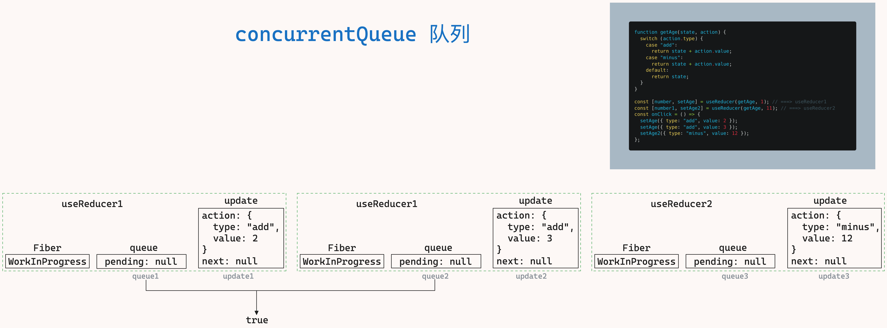
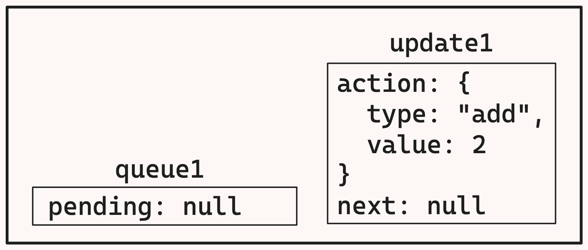
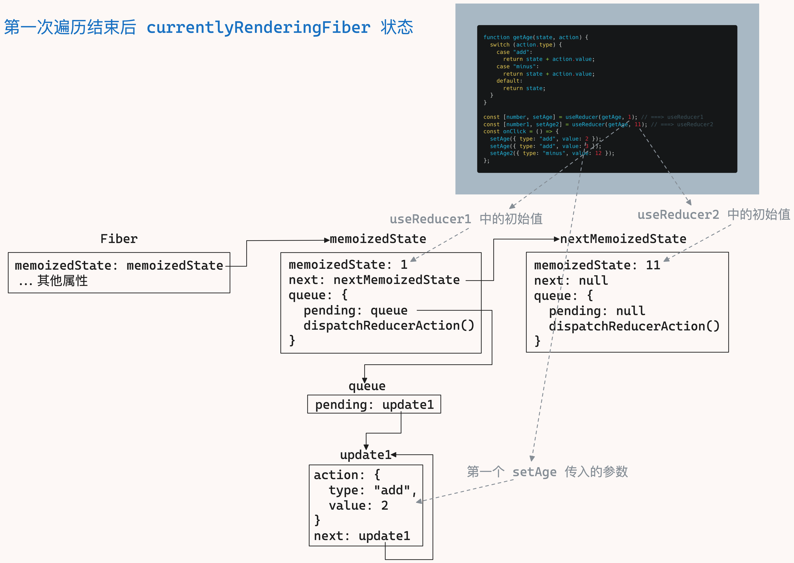

`fiber` 架构中的 `hooks` 我们从 `useReducer` 开始讲起，`useState` 其实是对 `useReducer` 的封装

## useReducer 定义

`useReducer` 从定义到到使用，过程有点复杂，因为文件很多，你引用我，我引用你，圈子兜的很大

### useReducer 定义的地方 ReactCurrentDispatcher.js

我们先来看定义，`react` 把 `useReducer` 定义在了 `ReactCurrentDispatcher.js` 文件中

```js
// react/src/ReactCurrentDispatcher.js
// useReducer 本体，定义的地方
const ReactCurrentDispatcher = { current: null };
```

`ReactCurrentDispatcher` 对象就是 `useReducer` 的本体，它有一个 `current` 属性，初始值为 `null`

### 开发者使用的 useReducer 在 ReactHooks.js

`ReactCurrentDispatcher` 定义好了之后，并没有直接导出给开发者使用，而是通过 `ReactHooks.js` 处理，然后在向外导出给开发者使用

向外导出的是 `useReducer` 函数，这个函数接收两个参数：

- `reducer`：是一个函数，接收两个参数，返回一个新的 `state`
  - `state`：是 `oldState`，也就是上一次的 `state`
  - `action`：是 `dispatch` 传入的参数
- `initialArg`：是 `state` 的初始值

这两个参数现在可以先不用管，等到后面用到的时候再来看

在 `useReducer` 函数中，没有直接使用 `ReactCurrentDispatcher`，而是通过 `resolveDispatcher` 函数来获取 `dispatcher`（不知道为什么这么设计，可能是为了处理一些其他逻辑吧）

通过 `dispatcher` 调用 `useReducer` 函数，不过这里你发现了没有，我们在定义 `ReactCurrentDispatcher` 时，它的 `current` 是 `null`，这里怎么可以调用 `useReducer` 呢？

那肯定是在后面某个地方给 `ReactCurrentDispatcher.current` 赋值了，我们这里先不管这个，这里只看 `useReducer` 的定义

```js
// react/src/ReactHooks.js
function resolveDispatcher() {
  // useReducer 本体
  return ReactCurrentDispatcher.current;
}

function useReducer(reducer, initialArg) {
  // 拿到 useReducer
  const dispatcher = resolveDispatcher();
  // 调用 useReducer
  // 我们定义的时候 ReactCurrentDispatcher.current 是 null，这里怎么可以调用 useReducer 呢？
  // 那肯定是在后面某个地方给 ReactCurrentDispatcher.current 赋值了
  return dispatcher.useReducer(reducer, initialArg);
}
```

### 给 React 自己使用的 useReducer 在 ReactSharedInternals.js

`useReducer` 定义好了，现在还没有给 `ReactCurrentDispatcher.current` 赋值

通过前面的学习我们知道 `react` 渲染有三个阶段：`beginWork`、`completeWork`、`commitWork`，而这三个阶段是在 `react-reconciler` 包中完成的

在这三个阶段中，`useReducer` 需要完成特定的工作，所以 `useReducer` 需要在 `react-reconciler` 包中使用

`react` 并没有在 `react-reconciler` 包中直接引入 `useReducer`，而是通过 `shared` 包中转的，具体看【`shared/ReactSharedInternals.js`】章节

所以 `react` 在这个文件中导出了一个 `ReactSharedInternals` 对象，这个对象是对 `ReactCurrentDispatcher` 的包装

```js
// react/src/ReactSharedInternals.js
import ReactCurrentDispatcher from "./ReactCurrentDispatcher";

// 将 useReducer 本体包装一下，给自己使用
const ReactSharedInternals = { ReactCurrentDispatcher };

export default ReactSharedInternals;
```

### 对外暴露的变量在 React.js 中转

内部使用的 `useReducer` 和外部使用的 `useReducer` 都已经准备好了，现在需要把它们暴露出去

但是 `react` 没有直接暴露，而是先通过 `React.js` 中转

在这里 `react` 做了一件有意思的事情，它把内部使用的 `useReducer` 取了一个特别长的别名，然后再暴露出去，这个别名还挺有意思：一个内部使用的变量，你如果使用了要被开除

不过要注意一点是：内部使用的 `useReducer` 和外部使用的 `useReducer` 结构不一样：

- 外部使用的 `useReducer`：`ReactCurrentDispatcher.current`
- 内部使用的 `useReducer`：`{ ReactCurrentDispatcher: { current: null } }`

```js
// react/src/React.js
// 给开发者使用
import { useReducer } from "./ReactHooks";
// 给 react 自己使用
import ReactSharedInternals from "./ReactSharedInternals";
export {
  // ReactCurrentDispatcher.current
  useReducer,
  // 给自己使用的时候，react 取了一个特别长的别名
  // { ReactCurrentDispatcher: { current: null } }
  ReactSharedInternals as __SECRET_INTERNALS_DO_NOT_USE_OR_YOU_WILL_BE_FIRED,
};
```

### 正式对外暴露是 react/index.js 中完成的

正式将 `useReducer` 暴露出去是在 `react/index.js` 中完成的

`useReducer` 是给开发者使用的，`__SECRET_INTERNALS_DO_NOT_USE_OR_YOU_WILL_BE_FIRED` 是给 `react` 内部其他包使用的

```js
// react/index.js
export {
  useReducer,
  // 这是 React 内部的一些方法和属性，是 React 内部使用的，不应在应用代码中使用
  __SECRET_INTERNALS_DO_NOT_USE_OR_YOU_WILL_BE_FIRED,
} from "./src/React";
```

### react 内部使用 useReducer 引用的是 shared/ReactSharedInternals.js

`react-reconciler` 包中是要使用 `useReducer` 的，但是 `react` 没有直接引入 `useReducer`，而是通过 `shared` 包做中转

```js
// shared/ReactSharedInternals.js
import * as React from "react";
// 给 react 自己使用
// { ReactCurrentDispatcher: { current: null } }
const ReactSharedInternals =
  React.__SECRET_INTERNALS_DO_NOT_USE_OR_YOU_WILL_BE_FIRED;

export default ReactSharedInternals;
```

### 总结

我们来看下它的目录结构：

```bash
- react
  - src
    - React.js  # 将 useReducer 和 ReactSharedInternals 暴露出去
    - ReactCurrentDispatcher.js # useReducer 本体在这个文本中
    - ReactHooks.js # 暴露给开发者的 useReducer 在这个文件中，从 ReactCurrentDispatcher.js 文件中引入
    - ReactSharedInternals.js # 暴露给 react 自己使用的 useReducer 在这个文件中，从 ReactCurrentDispatcher.js 文件中引入
  - index.js # React.js 中的变量从这里暴露出去
- shared
  - ReactSharedInternals.js # 暴露给 react 自己使用的 useReducer 在这个文件中，从 react/src/index.js 文件中引入
```

`react` 为了将 `useReducer` 暴露出去，绕了很大一圈，定义了两个变量：

- `useReducer`：给开发使用
- `__SECRET_INTERNALS_DO_NOT_USE_OR_YOU_WILL_BE_FIRED`：给 `react` 自己使用

你要说他好呗，`useReducer` 做到了和其他包解耦，其他包要使用 `userReducer`，只需要从 `shared` 中引入就好了，不需要关心 `react` 包提供的 `api` 了

你要说它不好呗，之前 `jsxDEV` 直接从 `react` 包中引入呢？

## useReducer 赋值

在页面初次渲染时，首先会进入 `beginWork` 阶段，在这个阶段会处理各种节点，包括函数节点，标签节点等

但是在初次渲染时，`react` 是不知道当前是不是函数组件，都会进入 `IndeterminateComponent` 分支中，进入这个分支后，会将函数组件的 `workInProgress.tag` 设置为 `FunctionComponent`

每次触发更新，`react` 都是从根元素开始更新(也就是 `FiberRoot`)，所以更新的时候也会进入 `beginWork` 阶段，由于在更新时已经知道当前能够区分函数组件了，所以或进入 `FunctionComponent` 分支

```js
function beginWork(current, workInProgress) {
  // 根据 tag 的类型分别处理
  switch (workInProgress.tag) {
    // 初次渲染时，不知道当前是不是函数组件，都会进入这个分支
    case IndeterminateComponent: {
      // ...
      break;
    }
    // 更新的时候已经知道当前是函数节点了
    case FunctionComponent: {
      // ...
      break;
    }
  }
}
```

不管是 `IndeterminateComponent` 分支还是 `FunctionComponent` 分支进入 `renderWithHooks` 函数

这个函数中，之前只执行了函数组件，没有处理组件中的各种 `hook`，所以 `useReducer` 的赋值是发生在这里的

```js
function renderWithHooks(current, workInProgress, Component, props) {
  // 函数组件执行
  const children = Component(props);
  return children;
}
```

### 修改 renderWithHooks 函数，支持 useReducer

初次渲染和更新渲染，`react` 定义了两个不同的函数：

```js
// 函数组件挂载时执行的 useReducer
const HooksDispatcherOnMount = {
  useReducer: mountReducer,
};

// 函数组件更新时执行的 useReducer
const HooksDispatcherOnUpdate = {
  useReducer: updateReducer,
};
```

那怎么判断当前是初次渲染还是更新渲染呢？

`react` 是通过判断 `current` 是否有值

我们知道在 `react` 中，`current` 代表已经渲染在页面中的 `DOM` 树，`workInProgress` 代表正在处理的 `DOM` 树

如果 `current` 没有值，说明现在是初始渲染阶段，应该调用给 `mountReducer`，否则调用 `updateReducer`（更新就是调用 `setXX` 的时候）

这里还要定义 `3` 个全局变量：

- `currentlyRenderingFiber`：当前正在处理的 `workInProgress`，主要用来保存 `memoizedState`，它的值来自于 `newHook`
- `currentHook`：当前正在处理的 `current` 的 `hook`，来自于 `currentlyRenderingFiber.memoizedState`
  - 这个值只在更新时使用
- `workInProgressHook`：当前正在处理的 `workInProgress` 的 `hook`
  - 初次渲染时，`workInProgressHook` 的值来自于 `newHook`
  - 更新时，`workInProgressHook` 的值也来自于 `newHook`，`newHook` 来自于 `currentHook`

```js
// react-reconciler/src/ReactFiberHooks.js

// 在进入 mountReducer 或者 updateReducer 是，会创建一个 newHook
//  - mountReducer 阶段 newHook 的各个属性都是 null：如：{ memoizedState: null, queue: null, next: null }
//  - updateReducer 阶段 newHook 的各个属性来自于 currentHook：如：{ memoizedState: currentHook.memoizedState, queue: currentHook.queue, next: null }
// currentlyRenderingFiber.memoizedState === newHook，workInProgressHook === newHook
// 改变 newHook 就会改变 workInProgressHook 和 currentlyRenderingFiber.memoizedState
// 改变 workInProgressHook 也会给变 newHook 和 currentlyRenderingFiber.memoizedState
// 所以在 mountReducer 或者 updateReducer 中，workInProgressHook 就是 newHook
let currentlyRenderingFiber = null;
let workInProgressHook = null;
// currentHook 值来自于 currentlyRenderingFiber.memoizedState，表示当前正在处理的 hook
// 第二次来自于 currentHook.next
// 只在更新时使用
let currentHook = null;

// current 表示已经渲染在页面中的 DOM 树
// workInProgress 表示正在处理的 DOM 树
function renderWithHooks(current, workInProgress, Component, props) {
  // 将 workInProgress 保存到全局中
  currentlyRenderingFiber = workInProgress;
  // 如果 current 有值，说明是更新，否则是初次渲染
  // 当然，如果没有要更新的 state，也不用走更新逻辑
  if (current !== null && current.memoizedState !== null) {
    // 更新，setXXX 时，给 useReducer 赋值
    ReactCurrentDispatcher.current = HooksDispatcherOnUpdate;
  } else {
    // 初始渲染，给 useReducer 赋值
    ReactCurrentDispatcher.current = HooksDispatcherOnMount;
  }
  // 函数组件执行
  const children = Component(props);
  // 函数执行完之后需要将这三个值重置
  currentlyRenderingFiber = null;
  workInProgressHook = null;
  currentHook = null;
  return children;
}
```

### useReducer 使用说明

在正式进入具体的函数功能前，我们要弄明白 `react` 函数的调用

我们假设现有如下的代码：

```js
function getAge(state, action) {
  switch (action.type) {
    case "add":
      return state + action.value;
    case "minus":
      return state + action.value;
    default:
      return state;
  }
}
const [number, setAge] = useReducer(getAge, 1); // ===> useReducer1
const [number1, setAge2] = useReducer(getAge, 11); // ===> useReducer2
const onClick = () => {
  setAge({ type: "add", value: 2 });
  setAge({ type: "add", value: 3 });
  setAge2({ type: "minus", value: 12 });
};
```

当 `react` 在运行时（初次渲染或更新），`mountReducer` 或者 `updateReducer` 函数都是执行两次

当用户点击时会触发 `onClick` 事件，`onClick` 事件中调用了 `setAge` 和 `setAge2`，他们会触发三次 `dispatchReducerAction` 函数（`dispatchReducerAction` 具体看 【`dispatchReducerAction`】章节）

接下来我们先来看 `mountReducer`

## useReducer 挂载 —— HooksDispatcherOnMount

`HookDispatcherOnMount` 函数在页面初次渲染时调用，它的作用是给 `useReducer` 赋值，核心函数是由 `mountReducer` 实现

### mountReducer 函数

`mountReducer` 函数接受两个参数：

- `reducer`：是一个函数，接收两个参数，返回一个新的 `state`（初次渲染时，这个参数没有用到）
  - `state`：是 `oldState`，也就是上一次的 `state`
  - `action`：是 `dispatch` 传入的参数
- `initialArg`：是 `state` 的初始值

这个函数主要功能是：函数组件中的编写的 `useReducer` 的初始值用链表的形式保存起来，并挂载到当前的 `workInProgress` 上（也就是 `currentlyRenderingFiber`）

如下图所示：


具体过程如下：

1. 为当前正在工作的函数组件（也就是 `workInProgress`）创建一个 `workInProgressHook`，详细见【`mountWorkInProgressHook`】章节
2. 将 `useReducer` 的初始值保存到 `workInProgressHook.memoizedState` 中
3. 创建一个链表 `queue`，将 `queue` 保存到 `workInProgressHook.queue` 中，用来保存 `dispatchReducerAction` 传入的参数 `action`（也就是 `setAge` 传入的参数）
4. 创建一个更新函数 `dispatchReducerAction`，这个函数是用来触发更新的（`setAge` 调用时触发），详细见 【`useReducer` 触发更新】章节
5. 设置 `useReducer` 的返回值，也就是 `memoizedState` 和 `dispatchReducerAction`

这里要注意的在 `mountReducer` 运行结束后，只创建了 `currentlyRenderingFiber.memoizedState` 的链表，这个链表保存的是 `useReducer` 的初始值

```js
// react-reconciler/src/ReactFiberHooks.js
function mountReducer(reducer, initialArg) {
  // 这里的前提的是在一个函数组件中：
  // 每写一个 hook(不管是 useReducer 还是 useState 等) mountReducer 就会执行一次
  // 从第一个 hook 到最后一个 hook 通过链表的方式连接起来，也就是 next 属性
  // 第一个 hook 的 next 指向第二个 hook，第二个 hook 的 next 指向第三个 hook，直到最后一个 hook，它的 next 为 null
  const hook = mountWorkInProgressHook();
  // 将函数组件中的初始值都保存到 currentlyRenderingFiber.memoizedState 中
  // 第一次运行时 hook.memoizedState 是 currentlyRenderingFiber.memoizedState.memoizedState
  // 第二次运行时 hook.memoizedState 是 currentlyRenderingFiber.memoizedState.next.memoizedState
  // 以此类推 ...
  hook.memoizedState = initialArg;
  const queue = { pending: null };
  // 创建一个链表，queue 用来存储 action，也就是 setAge 传入的参数
  // 第一次运行时 hook.queue 是 currentlyRenderingFiber.memoizedState.queue
  // 第二次运行时 hook.queue 是 currentlyRenderingFiber.memoizedState.next.queue
  // 以此类推 ...
  hook.queue = queue;
  queue.dispatch = dispatchReducerAction.bind(
    null,
    currentlyRenderingFiber,
    queue
  );
  // useReducer 的返回值 [age, setAge]
  return [hook.memoizedState, queue.dispatch];
}
```

### mountWorkInProgressHook

特别提醒，此函数会运行两次，因为有两个 `useReducer`

`mountWorkInProgressHook` 函数主要是将 `useReducer` 传入的初始值以链表的形式保存到 `currentlyRenderingFiber.memoizedState` 中

`workInProgressHook` 有三个属性：

- `memoizedState`：是 `state` 的值，也就是 `1`，`11`
- `queue`：在 `mountReducer` 阶段还是一个空，但是这里会构建出一个链表的结构，只不过值都是空的
- `next`：是下一个 `hook`

也就是说有多个 `useReducer` 时，那么 `currentlyRenderingFiber.memoizedState` 就是第一个 `useReducer`：

- `currentlyRenderingFiber.memoizedState.next` 就是第二个 `useReducer`，以此类推
- `currentlyRenderingFiber.memoizedState.memoizeState` 保存的是 `initialArg`
- `currentlyRenderingFiber.memoizedState.queue` 是用来保存 `setAge` 传入的参数 `action`，只不过现在是空的（这个要到 `setAge` 触发时，才会有值，详见【`useReducer` 触发更新】章节）

具体过程如下：

1. `mountWorkInProgress` 第一次运行是 `useReducer(getAge, 1)`
   
2. `mountWorkInProgress` 第二次运行是 `useReducer(getAge, 11)`
   

```js
// react-reconciler/src/ReactFiberHooks.js
function mountWorkInProgressHook() {
  const hook = { memoizedState: null, queue: null, next: null };
  // currentlyRenderingFiber.memoizedState 是第一个 useReducer
  // currentlyRenderingFiber.memoizedState.next 是第二个 useReducer
  // currentlyRenderingFiber.memoizedState.memoizedState 保存的是 initialArg1
  // currentlyRenderingFiber.memoizedState.queue 用在保存 action
  if (workInProgressHook === null) {
    // workInProgress === null 表示是当前处理的是函数组件中的第一个 hook
    // mountWorkInProgressHook 第一次运行会走这里
    currentlyRenderingFiber.memoizedState = workInProgressHook = hook;
  } else {
    // mountWorkInProgressHook 从第二次运行开始会走这里
    workInProgressHook = workInProgressHook.next = hook;
  }
  return workInProgressHook;
}
```

## useReducer 触发更新 —— dispatchReducerAction

`useReducer` 触发更新是在调用 `setAge` 时，如下代码：

```js
const [age, setAge] = useReducer(getAge, 1);
const [age1, setAge1] = useReducer(getAge, 11);
const onClick = () => {
  setAge({ type: "add", value: 2 });
  setAge({ type: "add", value: 3 });
  setAge1({ type: "minus", value: 12 });
};
```

触发更新的入口是 `dispatchReducerAction` 函数，是 `useReducer` 的核心函数，它接收三个参数

- `fiber`：当前正在处理的 `workInProgress`（这里用不到）
- `queue`：初始时是 `{ pending: null }`，用来保存 `action`
  - 这里 `queue` 虽然只是一个对象，但实际是 `currentlyRenderingFiber.memoizedState` 中的 `queue`
    - 第一个 `setAge({ type: "add", value: 2 })` 时，`queue` 是 `currentlyRenderingFiber.memoizedState.queue`
    - 第二个 `setAge({ type: "add", value: 3 })` 时，`queue` 是 `currentlyRenderingFiber.memoizedState.queue.next`
    - 第三个 `setAge1({ type: "minus", value: 12 })` 时，`queue` 是 `currentlyRenderingFiber.memoizedState.next.queue`
  - 为什么第一个 `setAge` 和第二个 `setAge` 的 `queue` 是同一个？
    - 因为第一个 `setAge` 和第二个 `setAge` 都是调用的同一个 `useReducer`，所以 `queue` 是同一个
- `action`：`setAge` 传入的参数

这个函数的主要功能是将传入的 `queue`，`update` 放入队列中（详细见【`enqueueConcurrentHookUpdate`】），然后调用 `scheduleUpdateOnFiber` 函数从 `FiberRoot` 开始更新

```js
// react-reconciler/src/ReactFiberHooks.js
// fiber：当前正在处理的 workInProgress（这里用不到）
// queue：初始时是 { pending: null }，用来保存 action
//   - 这里 queue 虽然只是一个对象，但实际是 currentlyRenderingFiber.memoizedState 中的 queue
//     - 第一个 setAge({ type: "add", value: 2 }) 时，queue 是 currentlyRenderingFiber.memoizedState.queue
//     - 第二个 setAge({ type: "add", value: 3 }) 时，queue 是 currentlyRenderingFiber.memoizedState.queue.next
//     - 第三个 setAge1({ type: "minus", value: 12 }) 时，queue 是 currentlyRenderingFiber.memoizedState.next.queue
//   - 为什么第一个 setAge 和第二个 setAge 的 queue 是同一个？
//     - 因为第一个 setAge 和第二个 setAge 都是调用的同一个 useReducer，所以 queue 是同一个
// action：setAge 传入的参数
function dispatchReducerAction(fiber, queue, action) {
  const update = { action, next: null };
  const root = enqueueConcurrentHookUpdate(fiber, queue, update);
  // scheduleUpdateOnFiber 会调用 finishQueueingConcurrentUpdates
  // finishQueueingConcurrentUpdates 是由 requestIdleCallback 触发，所以下面是异步的
  scheduleUpdateOnFiber(root);
}
```

`scheduleUpdateOnFiber` 函数调用过程如图所示：


### enqueueConcurrentHookUpdate

`enqueueConcurrentHookUpdate` 函数的作用是将 `update` 放入队列中，然后返回 `FiberRoot`

将 `update` 放入队列由于 `enqueueUpdate` 完成，返回 `FiberRoot` 由 `getRootForUpdateFiber` 完成

`enqueueConcurrentHookUpdate` 函数运行结束后，`concurrentQueue` 队列如图所示：


```js
// react-reconciler/src/ReactFiberConcurrentUpdates.js
// fiber 是当前正在处理的 fiber
// queue 是 workInProgressHook.queue 初始时是 { pending: null }
// update 是将 action 封装了
function enqueueConcurrentHookUpdate(fiber, queue, update) {
  enqueueUpdate(fiber, queue, update);
  return getRootForUpdateFiber(fiber);
}
```

#### enqueueUpdate

`enqueueUpdate` 函数接收三个参数

- `fiber`：是当前正在处理的 `fiber`
- `queue`：初始时是 `{ pending: null }`
- `update`：封装了 `action`

将这个三个参数一个个的保存到全局数组中 `concurrentQueue` 中，然后将 `concurrentQueuesIndex` 加 `1`

```js
// react-reconciler/src/ReactFiberConcurrentUpdates.js
const concurrentQueue = [];
let concurrentQueuesIndex = 0;

// fiber 是当前正在处理的 fiber
// queue 初始时是 { pending: null }
// update 封装了 action
// 运行结束后 [fiber, queue, update, fiber, queue, update, fiber, queue, update]
function enqueueUpdate(fiber, queue, update) {
  concurrentQueue[concurrentQueuesIndex++] = fiber;
  concurrentQueue[concurrentQueuesIndex++] = queue;
  concurrentQueue[concurrentQueuesIndex++] = update;
}
```

#### getRootForUpdateFiber

`getRootForUpdateFiber` 函数的作用是找到当前 `workInProgress` 的 `FiberRoot`

```js
// react-reconciler/src/ReactFiberConcurrentUpdates.js
// sourceFiber 是当前正在处理的 fiber，也就是 workInProgress
function getRootForUpdateFiber(sourceFiber) {
  let node = sourceFiber;
  let parent = sourceFiber.return;
  while (parent !== null) {
    node = parent;
    parent = parent.return;
  }
  return node.tag === HostRoot ? node.stateNode : null;
}
```

### finishQueueingConcurrentUpdates

`finishQueueingConcurrentUpdates` 函数作用是将 `concurrentQueue` 中的 `queue` 和 `update` 组装成链表

这里还挺巧妙的，`finishQueueingConcurrentUpdates` 函数是在 `scheduleUpdateOnFiber` 函数中调用的

而 `scheduleUpdateOnFiber` 函数有两处调用的地方：

1. 在初次渲染时在 `render` 函数中调用
   - 换句话在初次渲染时也会调用 `finishQueueingConcurrentUpdates` 函数，只不过函数里面的逻辑不会执行（因为条件不满足）
2. 更新时在 `dispatchReducerAction` 函数中调用

也就说 `setAge` 多次触发，`finishQueueingConcurrentUpdates` 函数会多次调用，但是它和 `enqueueConcurrentHookUpdate` 函数不是同步调用

因为 `scheduleUpdateOnFiber` 函数中会使用 `requireIdleCallback` 函数，这个函数会异步执行，也就是说 `finishQueueingConcurrentUpdates` 是异步执行的

当 `setAge` 多次调用时，`enqueueConcurrentHookUpdate` 是同步执行，会将 `queue` 和 `update` 放入 `concurrentQueue` 队列中，当`finishQueueingConcurrentUpdates` 函数执行时，队列已经就绪了

但是不管 `finishQueueingConcurrentUpdates` 函数执行多少次，它只会遍历一次 `concurrentQueue` 队列，因为处理完 `concurrentQueue` 队列后，会将 `concurrentQueuesIndex` 设置为 `0`

#### 链表组装

当 `enqueueConcurrentHookUpdate` 函数执行结束后，`concurrentQueue` 中的结构是：

```js
concurrentQueue = [Fiber, queue, update, Fiber, queue, update, Fiber, queue, update, ...]
```

如图所示：


链表的组装是将 `queue` 和 `update` 连在一起：

- `update` 是 `setAge` 的参数 `action`
- `queue` 的结构是：`{ pending: null }`
  - 组装结束后 `pending` 的内容是 `update`

对于同一个 `useReducer`，它在 `concurrentQueue` 中的 `queue` 是同一个

所以在遍历时组装的过程是：

1. 从 `concurrentQueue` 中取出第一组 `queue` 和 `update`
   
2. 如果 `queue.pending` 为 `null`，将 `update.next` 指向 `update`，也就是自身指向自身
   
3. 并将 `update` 赋值给 `queue.pending`
   
4. 进入第二次循环，从 `concurrentQueue` 中取出第二组 `queue` 和 `update`
   
5. `queue.pending` 不为 `null`
   - 先将 `update1.next` 赋值给 `update2.next`
   - 再将 `update2` 赋值给 `queue.pending.next`
     
6. 最后在将 `update2` 赋值给 `queue.pending`
7. 进入第三次循环，取出第三组 `queue` 和 `update`，由于第三组的 `queue` 的和前两组 `queue` 不属于同一个 `useReducer`，重新进入过步骤 ①，所以会组装成一个新的链表
8. 直到 `concurrentQueue` 全部遍历结束

遍历时 `queue`、`update`、`currentlyRenderingFiber` 的变化过程

1. 第一次遍历的过程
   
   - 第一次遍历结束后 `currentlyRenderingFiber` 的结构
     
2. 第二次遍历的过程
   
   - 第二次遍历结束后 `currentlyRenderingFiber` 的结构
     
3. 第三次遍历的过程
   
   - 第三次遍历结束后 `currentlyRenderingFiber` 的结构
     

第三次遍历结束后 `currentlyRenderingFiber`（也就是 `workInProgress`）就是完整的链表结构了，这是一个待更新的链表

接下来就是更新链表了，这个过程在 `updateReducer` 函数中完成

```js
// react-reconciler/src/ReactFiberConcurrentUpdates.js
// 连续调用多次 setXXX，这个函数会多次运行，但是循环只有一次
function finishQueueingConcurrentUpdates() {
  const endIndex = concurrentQueuesIndex;
  concurrentQueuesIndex = 0;
  let i = 0;
  while (i < endIndex) {
    const fiber = concurrentQueue[i++];
    const queue = concurrentQueue[i++];
    const update = concurrentQueue[i++];
    if (queue !== null && update !== null) {
      const pending = queue.pending;
      if (pending === null) {
        update.next = update;
      } else {
        update.next = pending.next;
        pending.next = update;
      }
      queue.pending = update;
    }
  }
}
```

## useReducer 更新 —— HooksDispatcherOnUpdate

`HooksDispatcherOnUpdate` 函数是在页面更新时调用的，它的作用是将 `useReducer` 从挂载变成更新，核心函数是由 `updateReducer` 实现

`useReducer` 挂载是在 `beginWork` 阶段完成，但是更新是在两个阶段完成的：

- `beginWork` 阶段：完成数据更新
- `completeWork` 阶段：完成 `DOM` 树的更新

为什么这么做？

因为 `beginWork` 是将虚拟 `DOM` 转变成 `Fiber` 的阶段，而 `completeWork` 是将 `Fiber` 转变成真实 `DOM` 的阶段

## useReducer 更新数据 —— beginWork

`updateReducer` 在函数组件是在 `beginWork` 阶段执行的，它接收一个 `reducer` 参数，这个参数是 `useReducer` 传入的 `getAge` 函数

```js
function getAge(state, action) {
  switch (action.type) {
    case "add":
      return state + action.value;
    case "minus":
      return state + action.value;
    default:
      return state;
  }
}
```

### updateReducer

首先我们需要知道，这个函数会触发 `6` 次，为什么会触发 `6` 次呢？

回到我们上面的代码：

```js
const [number, setAge] = useReducer(getAge, 1); // ===> useReducer1
const [number1, setAge2] = useReducer(getAge, 11); // ===> useReducer2
const onClick = () => {
  setAge({ type: "add", value: 2 });
  setAge({ type: "add", value: 3 });
  setAge2({ type: "minus", value: 12 });
};
```

第一次调用 `setAge` 时，会进入一次 `renderWithHooks` 函数，`renderWithHooks` 函数会执行我们的函数组件，当函数组件执行时，因为有两个 `useReducer`，所以 `updateReducer` 会执行两次

第二次调用 `setAge` 时，也是一样的逻辑，所以 `updateReducer` 又会执行两次

到第三次调用 `setAge2` 时，也是一样的逻辑，所以 `updateReducer` 又执行两次

所以 `updateReducer` 总共执行了 `6` 次

但是 `react` 只在第一次执行函数组件时执行相关逻辑，后面的重复执行时，很多逻辑都不会走

这里只分析前两次，由于前两次就已经把 `useReducer` 都处理完了，所以后面 `4` 没有分析的意义了

具体过程如下：

1. 第一次进入 `updateReducer` 函数时，先执行 `updateWorkInProgressHook` 函数，详细见【`updateWorkInProgressHook`】章节，拿到的 `hook` 结构如下图所示：
   
   - 对 `hook.queue` 进行遍历处理，然后调用传入的 `reducer` 函数对 `state` 进行处理，处理结束后，再将最新的 `state` 赋值给 `hook.memoizedState`，如下图所示：
     
2. 第二次进入 `updateReducer` 函数时，再次执行 `updateWorkInProgress` 函数，拿到的`hook` 结构如下图所示：
   
   - 对 `hook.queue` 进行遍历处理，然后调用传入的 `reducer` 函数对 `state` 进行处理，处理结束后，再将最新的 `state` 赋值给 `hook.memoizedState`，如下图所示：
     

至此对 `hook` 的处理都结束了，也就是说先已经生成最新的 `Fiber` 树了

```js
// react-reconciler/src/ReactFiberHooks.js
function updateReducer(reducer) {
  // 这里的前提的是在一个函数组件中：
  // 每写一个 hook(不管是 useReducer 还是 useState 等) mountReducer 就会执行一次
  // 从第一个 hook 到最后一个 hook 通过链表的方式连接起来，也就是 next 属性
  // 第一个 hook 的 next 指向第二个 hook，第二个 hook 的 next 指向第三个 hook，直到最后一个 hook，它的 next 为 null
  const hook = updateWorkInProgressHook();
  const queue = hook.queue;
  const pending = queue.pending;
  let newState = hook.memoizedState;
  // 只在第一次执行函数组件时执行
  // 执行一次函数组件会运行两次 updateReducer
  if (pending !== null) {
    // 这一步很关键
    // 这个 queue.pending = null 就是为了断开链表
    // 因为函数组件第二次执行时，这个队列已经没有任何待处理的数据了
    queue.pending = null;
    const firstUpdate = pending.next;
    let update = firstUpdate;
    // do...while 循环，至少会执行一次
    do {
      const action = update.action;
      // 调用 useReducer 传入的 reducer 函数，更新 state
      newState = reducer(newState, action);
      update = update.next;
    } while (update !== null && update !== firstUpdate);
  }
  hook.memoizedState = newState;
  // 将最新的状态返回出去
  return [hook.memoizedState, queue.dispatch];
}
```

### updateWorkInProgressHook

特别提醒此函数会运行 `6` 次，因为有两个 `useReducer`，并且触发了 `3` 次 `setXXX`，具体原因上面分析过

我们这里只分析前两次

1. `updateWorkInProgressHook` 第一次运行时：
   - `workInProgress`（也就是 `currentRenderingFiber`） 的状态，如图所示：
     
   - 当 `updateWorkInProgressHook` 函数第一次运行结束时，`workInProgress` 结构如下图所示
     
   - 简化后的结构如下图所示：
     
     
2. `updateWorkInProgressHook` 第二次运行时：
   - `workInProgress`（也就是 `currentRenderingFiber`） 的状态，如图所示：
     
   - 当 `updateWorkInProgressHook` 函数第二次运行结束时，`workInProgress` 结构如下图所示：
     

```js
// react-reconciler/src/ReactFiberHooks.js
function updateWorkInProgressHook() {
  // updateWorkInProgressHook 函数第一运行时 currentHook 为 null
  if (currentHook === null) {
    const current = currentlyRenderingFiber.alternate;
    currentHook = current.memoizedState;
  } else {
    currentHook = currentHook.next;
  }
  const newHook = {
    memoizedState: currentHook.memoizedState,
    queue: currentHook.queue,
    next: null,
  };
  if (workInProgressHook === null) {
    // 这一步很巧妙，改变了 currentlyRenderingFiber.memoizedState 的引用
    // 因为 newHook 是新对象，所以 currentlyRenderingFiber.memoizedState 是一个全新的对象，和之前的 currentlyRenderingFiber.memoizedState 没有关系了
    // 其次 currentlyRenderingFiber.memoizedState 和 workInProgressHook 是同一个对象，之后在改变 workInProgressHook.next 时，也会改变 currentlyRenderingFiber.memoizedState.next
    currentlyRenderingFiber.memoizedState = workInProgressHook = newHook;
  } else {
    workInProgressHook = workInProgressHook.next = newHook;
  }
  return workInProgressHook;
}
```

## useReducer 更新真实 DOM —— completeWork

`beginWork` 阶段处理完成之后，接下来就是 `completeWork` 阶段了，这个阶段是将 `Fiber` 转变成真实 `DOM`

这个阶段主要做什么事情呢？

找到 `newProps` 和 `oldProps` 之间的区别，然后将需要更新的 `props` 放入 `updateQueue` 中，等待 `commitWork` 阶段的更新

首先先对 `completeWork` 函数进行改造一下，不管是初次渲染还是更新，最终的落脚点都是真实的 `DOM` 节点

所以我们通过判断 `current` 是否存在，并且真实节点已经创建好了，就进入 `updateHostComponent` 函数，详见【`updateHostComponent`】章节

同时我们要对 `FunctionComponent` 函数节点收集 `flags` 和 `subtreeFlags`

```js
// react-reconciler/src/ReactFiberCompleteWork.js
function completeWork(current, workInProgress) {
  const newProps = workInProgress.pendingProps;
  switch (workInProgress.tag) {
    case HostComponent:
      const { type } = workInProgress;
      // 最终的落脚点都在真实节点上
      // 通过判断 current 是否存在，并且真实节点是否已经创建好了
      if (current !== null && workInProgress.stateNode !== null) {
        // 更新
        updateHostComponent(current, workInProgress, type, newProps);
      } else {
        // ...
      }
      bubbleProperties(workInProgress);
      break;
    case FunctionComponent:
      // 收集函数组件的 flags 和 subtreeFlags
      bubbleProperties(workInProgress);
      break;
    default:
      break;
  }
  return null;
}
```

### updateHostComponent

`updateHostComponent` 函数接收 `4` 个参数：

- `current`：构建完成的 `fiber` 树
- `workInProgress`：是构建中的 `fiber` 树
- `type`：真实的标签名
- `newProps`：需要更新的 `props`

这个函数主要做的功能准备好 `newProps` 和 `oldProps`，然后找出两个 `props` 之间的区别

然后挂载到 `updateQueue` 属性上，等待 `commitWork` 阶段的更新，并将 `flags` 设置为 `Update`

```js
// react-reconciler/src/ReactFiberCompleteWork.js
function updateHostComponent(current, workInProgress, type, newProps) {
  const oldProps = current.memoizedProps;
  const instance = workInProgress.stateNode;
  const updatePayload = prepareUpdate(instance, type, oldProps, newProps);
  workInProgress.updateQueue = updatePayload;
  if (updatePayload) {
    workInProgress.flags |= Update;
  }
}
```

#### prepareUpdate

`prepareUpdate` 函数只是做了一个转发，找出 `newProps` 和 `oldProps` 交给 `diffProperties`

```js
// react-dom-bindings/src/client/ReactDOMHostConfig.js
function prepareUpdate(domElement, type, oldProps, newProps) {
  return diffProperties(domElement, type, oldProps, newProps);
}
```

### diffProperties

`diffProperties` 分别对 `lastProps` 和 `nextProps` 处理，需要更新的 `props` 放入 `updatePayload` 中，它的结构是：

```js
// null 不是需要删除
// 样式属性直接置为 ""
["zhangsan", null, "xiaohong", "女", "style", { color: "" }];
```

`props` 的处理分为两步：

1. 先处理需要删除的 `propKey`，比如下面这样的代码：
   ```js
   const obj1 = { zhangsan: "男" };
   const obj2 = { xiaohong: "女" };
   <div {...(condition ? obj1 : obj2)}></div>;
   ```
2. 再处理需要修改的 `propKey`
   - 先处理 `lastProps` 中的 `style` 属性，如果有需要删除的属性，放入 `styleUpdates` 中，并将它的属性设置为 `""`
   - 再处理 `nextProps` 中的 `style` 属性，找到需要更新的属性，放入 `styleUpdates` 中，将它的属性设置为最新的值
   - `style` 处理完了之后，在处理 `children`，`children` 处理完了之后再处理其他属性，如果有变化，就行需要修改的属性放入 `updatePayload` 中
   - 直到所有属性都处理完了之后，如果存在 `styleUpdates`，将 `styleUpdates` 放入 `updatePayload` 中

到此为止 `completeWork` 都处理完成了，接下来进入 `commitWork` 阶段，进行处理

## useReducer 挂载 —— commitWork

`completeWork` 阶段处理完成之后，接下来就是 `commitWork` 阶段了，这个阶段是将 `updateQueue` 中的 `props` 更新到真实 `DOM` 上

`commitWork` 是在 `commitMutationEffectsOnFiber` 函数中处理各个节点

在更新阶段需要对 `HostComponent` 节点进行处理，所以我们在 `commitMutationEffectsOnFiber` 函数中找到 `HostComponent` 节点，然后调用 `commitUpdate` 函数

```js
// react-reconciler/src/ReactFiberCommitWork.js
function commitMutationEffectsOnFiber(finishedWork, root) {
  const flags = finishedWork.flags;
  const current = finishedWork.alternate;
  switch (finishedWork.tag) {
    case HostComponent: {
      recursivelyTraverseMutationEffects(root, finishedWork);
      commitReconciliationEffects(finishedWork);
      if (flags & Update) {
        const instance = finishedWork.stateNode;
        if (instance !== null) {
          const newProps = finishedWork.memoizedProps;
          const oldProps = current !== null ? current.memoizedProps : newProps;
          const type = finishedWork.type;
          const updatePayload = finishedWork.updateQueue;
          finishedWork.updateQueue = null;
          if (updatePayload !== null) {
            commitUpdate(instance, updatePayload, type, oldProps, newProps);
          }
        }
      }
      break;
    }
  }
}
```

### commitUpdate

`commitUpdate` 函数接收 `5` 个参数：

- `domElement`：`DOM` 实例
- `updatePayload`：需要更新的属性
- `type`：`DOM` 标签
- `newProps`：新的 `props`，在 `finishedWork.memoizedProps`
- `oldProps`：旧的 `props`，在 `current.memoizedProps`，如果 `current` 不存在就用 `newProps`

这个函数的逻辑就是调用：`updateProperties` 和 `updateFiberProps`

`updateFiberProps` 的作用是将最新的 `props` 放到 `DOM` 的一个私有对象 `internalPropsKey` 中

`updateProperties` 的作用是将最新的 `props` 挂载到 `DOM` 的属性上

```js
// react-dom-bindings/src/client/ReactDOMHostConfig.js
// domElement：DOM 实例
// updatePayload：需要更新的属性
// type：DOM 标签
// newProps`：新的 props，在 finishedWork.memoizedProps
// oldProps：旧的 props，在 current.memoizedProps，如果 current 不存在就用 newProps
function commitUpdate(domElement, updatePayload, type, oldProps, newProps) {
  updateProperties(domElement, updatePayload, type, oldProps, newProps);
  updateFiberProps(domElement, newProps);
}
```

```js
// react-dom-bindings/src/client/ReactDomComponent.js
function updateDomProperties(domElement, updatePayload) {
  for (let i = 0; i < updatePayload.length; i += 2) {
    const propKey = updatePayload[i];
    const propValue = updatePayload[i + 1];
    if (propKey === "style") {
      setValueForStyles(domElement, propValue);
    } else if (propKey === "children") {
      setTextContent(domElement, propValue);
    } else {
      setValueForProperty(domElement, propKey, propValue);
    }
  }
}
```

## useState

实现了 `useReducer` 之后，我们再来看 `useState`

`useState` 是 `useReducer` 的语法糖，它的实现原理和 `useReducer` 是一样的，只不过 `useState` 的 `reducer` 是内部实现的

它也和 `useReducer` 一样，由 `react` 包中定义

```js
// packages/react/src/ReactHooks.js
function useState(initialState) {
  const dispatcher = resolveDispatcher();
  return dispatcher.useState(initialState);
}
```

赋值的地方是在 `HooksDispatcherOnMount` 和 `HooksDispatcherOnUpdate` 对象中

```js
// 函数组件挂载时执行的 hooks
const HooksDispatcherOnMount = {
  useReducer: mountReducer,
  useState: mountState,
};

// 函数组件更新时执行的 hooks
const HooksDispatcherOnUpdate = {
  useReducer: updateReducer,
  useState: updateState,
};
```

现在能感受到 `react` 这么写的好处了吧，`react` 是把 `HooksDispatcherOnMount` 对象赋值给 `ReactCurrentDispatcher.current`，那外面拿到的就是 `{ useReducer, useState }`

在实际的源码中 `useState` 内部还有一些细节优化，不过主流程是一样的，所以这里就复用了 `mountReducer` 和 `updateReducer` 函数

```js
// react-reconciler/src/ReactFiberHooks.js
function mountState(initialState) {
  return mountReducer(null, initialState);
}
```

`baseStateReducer` 函数作用是：如果 `action` 是函数，就执行函数，否则直接返回 `action`

这是什么意思呢？因为在 `setState` 时，可以传入一个函数，这个函数接收 `state` 作为参数，返回一个新的 `state`：

```js
setState((number) => number + 1);
```

源码如下：

```js
// react-reconciler/src/ReactFiberHooks.js
function baseStateReducer(state, action) {
  return typeof action === "function" ? action(state) : action;
}
function updateState() {
  return updateReducer(baseStateReducer);
}
```

## 源码

1. [useReducer-mount](https://github.com/astak16/react-source/blob/7acb4b30fbe0b22f599ca607c2fc31eab77623eb/react18-core/packages/react-reconciler/src/ReactFiberHooks.js#L30)
2. [useReducer-update](https://github.com/astak16/react-source/blob/7acb4b30fbe0b22f599ca607c2fc31eab77623eb/react18-core/packages/react-reconciler/src/ReactFiberHooks.js#L37)
3. [useState-mount](https://github.com/astak16/react-source/blob/7acb4b30fbe0b22f599ca607c2fc31eab77623eb/react18-core/packages/react-reconciler/src/ReactFiberHooks.js#L31)
4. [useState-update](https://github.com/astak16/react-source/blob/7acb4b30fbe0b22f599ca607c2fc31eab77623eb/react18-core/packages/react-reconciler/src/ReactFiberHooks.js#L38)
